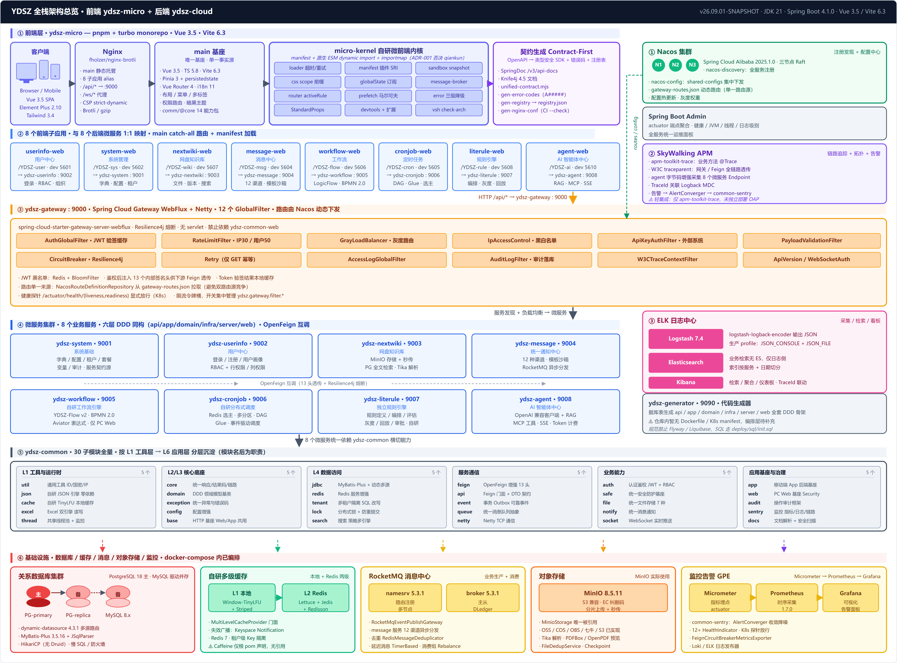

<p align="center">
  <h1 align="center">Ydsz Cloud</h1>
  <p align="center">
    基于 Jdk21 &amp; Spring Boot 4 &amp; Spring Cloud 的企业级微服务开发平台
  </p>
</p>

<p align="center">
  <a href="https://www.oracle.com/java/technologies/javase/jdk21-archive-downloads.html"></a>
  <a href="https://spring.io/projects/spring-boot"></a>
  <a href="https://spring.io/projects/spring-cloud"></a>
  <a href="https://github.com/alibaba/spring-cloud-alibaba"></a>
  <a href="./LICENSE"></a>
  <a href="https://maven.apache.org/"></a>
</p>

---

## 项目简介

**Ydsz Cloud** 是一套面向企业级应用的微服务快速开发平台，基于 **Spring Boot 4.0.8**、**Spring Cloud 2025.1.2** 和 **Spring Cloud Alibaba 2025.1.0.0** 构建。平台采用 **DDD（领域驱动设计）** 六层分层架构（`api` / `domain` / `infra` / `server` / `app` / `web`），内置 **11 大核心模块**（1 网关 + 9 微服务 + 1 代码生成器 + 1 公共依赖库），覆盖用户认证、系统管理、流程引擎、消息引擎、任务引擎、规则引擎、网盘引擎、智能引擎、代码生成等企业级全业务场景。

## 关联仓库

| 平台     | 前端仓库 |
|----------| -------- |
| Gitee    | https://gitee.com/njydsz/ydsz-micro |
| GitHub   | https://github.com/njydsz/ydsz-micro |
| 官方文档 | https://www.yuque.com/marvin-lee/ydsz-org |

---

## 核心特性

- **前沿技术栈**：Java 21 虚拟线程 + Spring Boot 4 + Spring Cloud 2025.1.2 + Jakarta EE 10
- **DDD 分层架构**：严格 `api` / `domain` / `infra` / `server` / `app` / `web` 六层分离，依赖方向单向收敛（gateway 为单模块 reactive 栈，不拆分 DDD 层）
- **自研引擎矩阵**：「规则引擎 + 任务调度 + 工作流（BPMN 2.0）+ AI Agent 框架」——四大引擎全部自研，开箱即用
- **多租户隔离**：支持 SINGLE（共享表）、MULTI（字段隔离）、ISOLATE_DB（独立数据库）三种策略
- **全渠道消息**：6 种通知渠道（短信/邮件/Push/企微/IM等），支持 DAG 编排与跨渠道抑制
- **安全纵深防御**：JWT + RBAC + 数据权限 + PII 脱敏 + XSS/SQL 注入/CSRF 防护 + 敏感配置加密（AES-256-GCM）
- **生产可观测**：Prometheus + Grafana + Sentry + ELK/Loki + Micrometer Tracing（W3C TraceContext）

---

## 系统架构

YDSZ 是一套前后端分离的全栈微服务架构。前端 [ydsz-micro](https://gitee.com/njydsz/ydsz-micro) 采用 pnpm + turbo monorepo，以自研 micro-kernel 微前端内核（manifest + 原生 ESM dynamic import + importmap，ADR-001 明确否决 qiankun）整合 8 个 Vue 3 子应用，并基于后端 OpenAPI 契约自动生成类型安全 SDK 与错误码，用 CI 漂移门禁守住前后端边界。后端 [ydsz-cloud](https://gitee.com/njydsz/ydsz-cloud) 基于 JDK 21 + Spring Boot 4.0.8，由 ydsz-gateway（12 个全局过滤器、Nacos 动态路由）统一入口，按六层 DDD 同构拆分 8 个业务服务，共享 30 个 ydsz-common 公共子模块，底层依托 Nacos、PostgreSQL、Redis、RocketMQ 与 MinIO，并以 SkyWalking、ELK 与 Prometheus/Grafana 构建可观测体系。



### 服务端口规划

| 端口 | 服务 | 部署单元 | 说明 |
|------|------|----------|------|
| 8848 | Nacos | 中间件 | 注册中心 & 配置中心（独立部署） |
| 9000 | ydsz-gateway | ydsz-gateway | API 网关（WebFlux 反应式，单模块） |
| 9001 | ydsz-system | ydsz-system-web | 系统基础服务 |
| 9002 | ydsz-userinfo | ydsz-userinfo-web | 用户/认证/组织架构中心 |
| 9003 | ydsz-nextwiki | ydsz-nextwiki-web | 网盘知识库（Web 控制台） |
| 9003 | ydsz-userinfo | ydsz-userinfo-app | 移动端入口（与 nextwiki-web 同端口，**不可同机部署**，详见下方「已知事项」） |
| 9004 | ydsz-message | ydsz-message-web | 统一消息通知引擎 |
| 9005 | ydsz-workflow | ydsz-workflow-web | 自研工作流引擎 |
| 9006 | ydsz-cronjob | ydsz-cronjob-web | 分布式任务调度引擎 |
| 9007 | ydsz-literule | ydsz-literule-web | 规则引擎微服务 |
| 9008 | ydsz-agent | ydsz-agent-web | AI 智能体服务 |
| 8081 | ydsz-nextwiki | ydsz-nextwiki-app | 网盘移动端入口 |
| 9090 | ydsz-generator | ydsz-generator-web | 代码生成器（context-path: `/gen`） |

> 端口号取自各模块 `bootstrap.yml` / `application.yml`，为默认开发配置，生产环境应通过 Nacos `ydsz-{service}-{env}.yaml` 覆盖。

---

## 模块说明

```
ydsz-cloud/
├── ydsz-common/              # 🧱 公共能力底座（29 子模块，L1-L6 分层，不独立部署）
│   ├── ydsz-common-json      # L1：高性能 JSON 引擎（零外部依赖，自研 ASM/SIMD 优化）
│   ├── ydsz-common-util      # L1：工具类（加密/哈希/IP/雪花ID/Bean映射/密码强度）
│   ├── ydsz-common-cache     # L1：多策略本地缓存（W-TinyLFU / Striped / 防穿透击穿雪崩）
│   ├── ydsz-common-excel     # L1：高性能 Excel 双引擎（零 POI 快速路径 + POI 兼容路径 + ASM 字段访问 + FormulaInjectionGuard）
│   ├── ydsz-common-core      # L2：统一响应 YdszResponse / PageResponse / TraceId / RequestContext / 特性开关
│   ├── ydsz-common-domain    # L3：DDD 基类（PageQuery + 深度分页防护） / 树形结构 / 类型安全 TypedId
│   ├── ydsz-common-exception # L3：统一异常 AbstractYdszException / RFC 7807 ProblemDetail / 错误码体系 / i18n
│   ├── ydsz-common-jdbc      # L4：MyBatis-Plus 增强（行权限/列权限/SQL 防火墙/SQL 追踪 + 慢 SQL 审计 + 指纹归一化）
│   ├── ydsz-common-redis     # L4：Redis 9 类 Ops 封装 + 限流（固定/滑动/令牌桶） + 租户级 Key 前缀
│   ├── ydsz-common-lock      # L4：分布式锁（可重入/公平/联锁/读写/信号量） / 幂等 / 防重提交 / 分布式调度
│   ├── ydsz-common-thread    # L4：共享线程池（配置化/热更新/虚拟线程/Micrometer 指标/优雅关闭）
│   ├── ydsz-common-tenant    # L4：多租户上下文（SINGLE/MULTI/ISOLATE_DB/SCHEMA） + 全链路传播 + Redis Key 隔离
│   ├── ydsz-common-auth      # L5：RBAC 权限评估 + JWT Token + 列权限脱敏 + Token 黑名单 BloomFilter + CSRF + OIDC
│   ├── ydsz-common-safe      # L5：XSS 防护（Filter/Converter 双模式） + CSRF + 限流（令牌桶 11 维度 + 熔断） + 字段加密 + 敏感信息脱敏（18 种 SensitiveType） + SSRF + 二级认证 + 安全事件自动响应
│   ├── ydsz-common-feign     # L5：OpenFeign 统一增强（W3C 透传 + Micrometer + Resilience4j 熔断 + Bulkhead + GZIP + NameAssembler SPI）
│   ├── ydsz-common-audit     # L5：声明式 AOP 审计（@Audit） + 异步落库（批量写入） + 分表策略 + 跨分表查询
│   ├── ydsz-common-notify    # L5：6 种通知渠道（邮件/短信/企微/钉钉/飞书/站内信 Provider 策略模式） + 事务性发布 + DKIM 签名
│   ├── ydsz-common-queue     # L5：6 种 MQ 引擎（Redis Stream/Kafka/RocketMQ/List/Pub-Sub/RabbitMQ） + 死信 + 消费者限流
│   ├── ydsz-common-event     # L5：事务性 Outbox 模式 + 后台轮询器 + 指数退避重试 + 死信管理
│   ├── ydsz-common-config    # L5：Jasypt 增强层 + 配置变更桥接（ConfigChangeListener SPI）
│   ├── ydsz-common-socket    # L5：WebSocket STOMP + 集群广播（Redis Pub/Sub + 在线用户 + 离线补偿 + 心跳保活 + 熔断）
│   ├── ydsz-common-netty     # L5：TCP Server/Client 抽象 + LengthField 编解码 + SSL/TLS 双向认证 + Epoll/KQueue 自适应
│   ├── ydsz-common-file      # L5：7 种存储平台（Local/OSS/MinIO/S3/COS/OBS/Qiniu） + 分片上传 + 秒传 + Magic Number 校验
│   ├── ydsz-common-docs      # L5：8 种格式解析（PDF/Word/Excel/PPT/HTML/Markdown/TXT/CSV via Tika+POI+PDFBox） + PII 检测 + 安全扫描
│   ├── ydsz-common-search    # L5：SPI 多引擎搜索（PG tsvector + zhparser 中文分词 + 内存降级） + 索引同步 + 搜索建议 + 业务重排
│   ├── ydsz-common-sentry    # L5：指标采集（Micrometer + 内存降级） + 日志发布（ELK/Loki/双发） + SLA 框架 + 告警收敛 + 熔断
│   ├── ydsz-common-base      # L6：MVC 配置抽象基类 + CORS/时区/安全头/TraceId/OpenAPI
│   ├── ydsz-common-app       # L6：移动端 App 基座（API 签名 + AppAuthFilter + 请求追踪）
│   └── ydsz-common-web       # L6：PC Web 基座（全局响应包装 + 请求日志拦截 + 认证体系）
│
├── ydsz-generator/           # 🔧 代码生成器 :9090（Velocity 模板引擎，一键 DDD 分层 CRUD 代码生成）
│
├── ydsz-gateway/             # 🚪 API 网关 :9000（WebFlux 反应式）
├── ydsz-system/              # ⚙️ 系统基础服务 :9001（参数 / 字典 / 多租户）
├── ydsz-userinfo/            # 👤 用户信息中心 :9002（登录 / RBAC / 组织架构 / OAuth2）
├── ydsz-nextwiki/            # 📁 网盘知识库 :9003（文件管理 / Office 预览 / WOPI）
├── ydsz-message/             # 📨 消息通知引擎 :9004（12 渠道 / DAG 编排 / 灰度）
├── ydsz-workflow/            # 🔀 工作流引擎 :9005（BPMN 2.0 / DMN 决策表）
├── ydsz-cronjob/             # ⏰ 分布式调度 :9006（Leader 选举 / 分片广播）
├── ydsz-literule/            # 📏 规则引擎 :9007（DSL / 热加载 / A/B 测试）
└── ydsz-agent/               # 🤖 AI 智能体 :9008（ReAct / RAG / Tool Calling）
```

### 各模块能力详述

| 模块 | 核心能力 |
|------|----------|
| **ydsz-gateway** | 路由分发 · JWT 鉴权 · CORS · IP 黑白名单（统一 IpAccessControl） · 灰度路由（权重加权 + 比例分流） · Redis+Lua 令牌桶限流 · WebSocket 握手认证 · API 版本协商 · 网关层 RBAC · W3C 链路追踪 |
| **ydsz-system** | 系统参数（Redis 缓存 + 穿透防护） · 数据字典（树形 + 版本快照） · OAuth2 应用注册 · 多租户（租户 + 套餐 + 权限） · 全局搜索 |
| **ydsz-userinfo** | 登录认证（密码 + 验证码 + LDAP/ADFS） · JWT Token · RBAC 6 要素 · 部门树 · OAuth2 授权码 · 登录锁定（5 次/30 min） · 国际化 |
| **ydsz-nextwiki** | 文件秒传（SHA-256） · 版本控制（20 版本） · 分享 + ACL · 全文搜索 · Office 预览（LibreOffice → PDF） · WOPI（OnlyOffice/Collabora） · ClamAV 病毒扫描 · OCR · AI 摘要 |
| **ydsz-message** | 12 种通知渠道（枚举） · 模板（i18n + 版本） · 用户偏好 · 条件路由 + 通道降级链 · 模板灰度标记 · 敏感词过滤（DFA） · RocketMQ 死信 |
| **ydsz-workflow** | YDSZ-Flow + BPMN 2.0 · 11 种节点类型 · 定时器 · SLA · 设计器 · DMN 决策表 · 审批/委派/评论/嵌入式审批面板 |
| **ydsz-cronjob** | Leader 选举 · 多分区调度 · Cron + 固定频率 + 固定延迟 + API 触发 · 分片广播 · 故障转移 · DAG 编排 · 胶水代码编辑 · 异常自愈 |
| **ydsz-literule** | 6 种规则类型 · 自研 LiteExpr 引擎（AST + 沙箱） · 热加载 · 版本 Diff + 回滚 · Dry-Run 仿真 · A/B 测试 · 规则包/市场 · CEP 引擎 |
| **ydsz-agent** | 6 种 Agent 执行器 · LLM Provider 抽象 · 同步/流式对话（SSE） · RAG · DAG 编排 · Tool Calling / MCP 工具 · 安全护栏（PII + Prompt 注入检测） |
| **ydsz-generator** | 数据库逆向工程 · Velocity 模板引擎一键生成 DDD 分层 CRUD 代码（Entity/Mapper/Service/Controller/DTO/VO/Query/Converter/Assembler/Enum/Feign/Vue 前端 16 种产物） · 数据源管理 · 模板管理 · 导入导出 · 历史回溯 |

---

## 快速开始

### 环境要求

| 依赖 | 最低版本 | 说明 |
|------|----------|------|
| JDK | 21 | 推荐 Eclipse Temurin / Amazon Corretto |
| Maven | 3.9+ | 聚合多模块构建 |
| PostgreSQL | 15+ | 共享主数据库 |
| Redis | 7.x | 缓存 / 分布式锁 / 会话 |
| Nacos | 2.4+ | 注册中心 & 配置中心 |
| RocketMQ | 5.x | 消息队列（消息模块必选） |
| MinIO | — | 对象存储（网盘模块必选） |

### 克隆与构建

```bash
# 克隆仓库
git clone http://192.168.31.88:6080/ydszopen/ydsz-cloud.git
cd ydsz-cloud

# 编译全量模块（含单元测试）
mvn clean verify

# 快速构建（跳过测试，加速开发迭代）
mvn clean package -DskipTests
```

### 数据库初始化

> 项目规范**禁止**使用 Flyway / Liquibase 等 schema-migration 框架。数据库 DDL 统一以 SQL 脚本形式管理，**唯一维护目录为 `data/postgre/`**（按服务一文件，如 `data/postgre/ydsz-system.sql`）。
>
> 注：`data/legacy-dialects/` 下的 MySQL / Oracle 方言脚本为历史遗留转译产物，**不再随 PostgreSQL 版本同步维护**，仅作迁移参考。

```bash
# 1. 创建数据库
psql -U postgres -c "CREATE DATABASE ydsz_cloud;"

# 2. 按模块导入初始化脚本（唯一事实源：data/postgre/，示例）
psql -U postgres -d ydsz_cloud -f data/postgre/ydsz-common.sql
psql -U postgres -d ydsz_cloud -f data/postgre/ydsz-userinfo.sql
psql -U postgres -d ydsz_cloud -f data/postgre/ydsz-system.sql
# ...依此类推（data/postgre/ 下其余模块脚本）
```

### 本地启动

**启动顺序建议**：Nacos → 中间件 → Gateway → 业务服务（按端口号升序）

```bash
# 启动 Gateway（必须先启动）
cd ydsz-gateway
mvn spring-boot:run

# 启动各业务服务
cd ../../ydsz-userinfo/ydsz-userinfo-web && mvn spring-boot:run
cd ../../ydsz-system/ydsz-system-web && mvn spring-boot:run
cd ../../ydsz-nextwiki/ydsz-nextwiki-web && mvn spring-boot:run
cd ../../ydsz-message/ydsz-message-web && mvn spring-boot:run
cd ../../ydsz-workflow/ydsz-workflow-web && mvn spring-boot:run
cd ../../ydsz-cronjob/ydsz-cronjob-web && mvn spring-boot:run
cd ../../ydsz-literule/ydsz-literule-web && mvn spring-boot:run
cd ../../ydsz-agent/ydsz-agent-web && mvn spring-boot:run
cd ../../ydsz-generator/ydsz-generator-web && mvn spring-boot:run
```

启动完成后，访问 API 文档：
- **Knife4j 聚合文档**：`http://localhost:9000/doc.html`
- **Nacos 控制台**：`http://localhost:8848/nacos`（默认账密 nacos/nacos）

---

## 开发指南

### 工程结构约定

每个可部署的业务模块遵循标准 DDD 六层结构（网关模块除外，为单模块 reactive 栈）：

```
ydsz-{module}/
├── pom.xml                          # 父 POM
├── ydsz-{module}-domain/            # 领域层：Entity + VO + Repository 接口
├── ydsz-{module}-infra/             # 基础设施层：Repository 实现 + 外部集成
├── ydsz-{module}-server/            # 应用服务层：Service + 事务编排
├── ydsz-{module}-app/               # App 层：Controller + 启动类 + 配置
├── ydsz-{module}-web/               # Web 层：Controller + 启动类 + 配置
└── ydsz-{module}-api/                # API 层：Feign Client
```

**依赖方向**：`web/app → server → domain ← infra`，`api` 层独立对外。

### 代码规范

项目遵循以下编码标准：

- **云顶数字编码规范** —— Java 代码规范基线

---

## 文档

| 文档 | 位置 | 说明 |
|------|------|------|
| 项目 README | `./README.md` | 本文档 |
| MIT 开源协议 | `./LICENSE` | 开源许可协议 |
| 编码规范 | `./docs/云顶编码规范.md` | 云顶数字编码规范（Java 代码规范基线，含 common 分层约束） |
| 模块 README | `ydsz-*/README.md` | 各模块详细说明文档 |
| 本地开发环境 | `./docs/本地开发环境.md` | 本地中间件与 Nacos 配置说明 |
| API 文档 | Knife4j 聚合 | 启动后访问 `:9000/doc.html` |

---

## 贡献指南

欢迎参与 Ydsz Cloud 的建设。提交代码前请阅读并遵守以下约定：

- **编码规范**：所有 Java 代码须通过 `docs/云顶编码规范.md` 的 Checkstyle 校验（见 `docs/checkstyle.xml`）与 common 层 L1 纯度（`enforce-l1-purity`）构建检查；架构分层依赖方向由 ArchUnit 测试守护（各业务模块 `-web` 子模块 `ArchitectureTest`，对应规范 §22.1 / §34）。
- **质量门禁**：日常构建跑红线校验；提交 PR 前建议执行 `mvn verify -Pquality`（SpotBugs / OWASP / JaCoCo 报告 + Spotless 格式校验），基线达标后由维护者以 `-Pquality-enforce` 强制门禁。
- **文档同步**：代码变更若影响模块能力、端口、配置项，须同步更新对应 `README.md`，确保文档与代码事实一致（杜绝虚构条目）。
- **提交流程**：Fork → 分支开发 → 本地 `mvn clean verify` 通过 → 发起 Pull Request → Code Review 通过后方可合入。
- **依赖约束**：业务模块禁止直引第三方 JSON / Caffeine / POI 等（须使用 `ydsz-common-*` 自研封装）；公共依赖变更影响全部 9 个部署单元，须充分联调。

---

## 开源协议

本项目基于 **[MIT License](./LICENSE)** 开源，允许自由使用、修改、分发，但需保留原始版权声明。

---

## 致谢

本项目在设计与实现过程中，参考并致敬以下优秀开源项目：

- [Spring Boot](https://spring.io/projects/spring-boot) &amp; [Spring Cloud](https://spring.io/projects/spring-cloud) —— Java 微服务生态基石
- [Spring Cloud Alibaba](https://github.com/alibaba/spring-cloud-alibaba) —— 微服务一站式解决方案

---

<p align="center">
  <sub>Made with ❤️ by Ydsz Team</sub>
</p>
