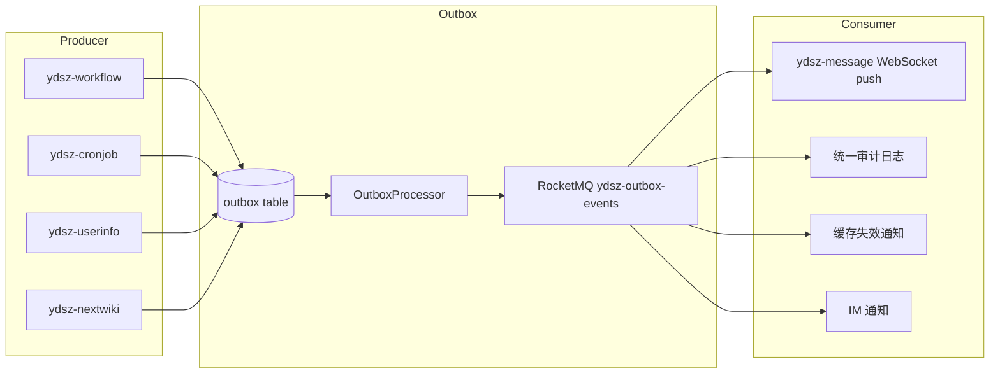
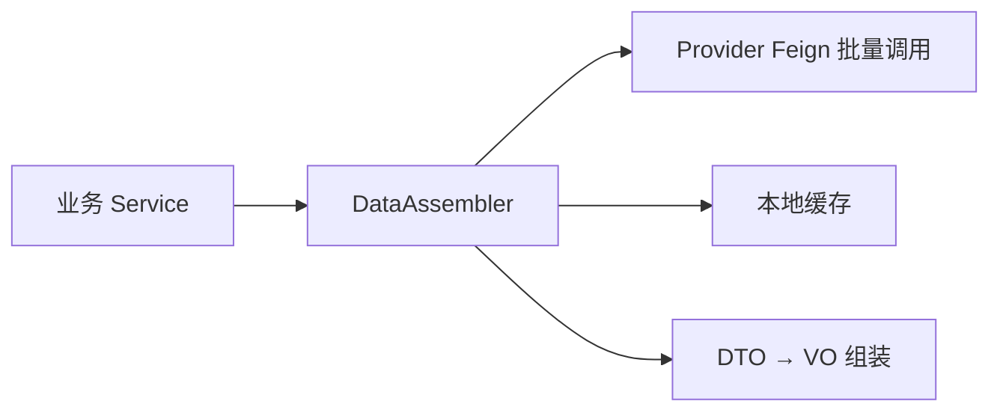

# YDSZ 架构治理与优化整改方案 V2.0

> 基于 V1.0.0 重构成果的深度复盘，对标行业主流竞品与互联网大厂研发规范制定

---

## 目录

1. [现状复盘](#1-现状复盘)
2. [总体整改目标](#2-总体整改目标)
3. [P0 级 - 架构治理与规范落地](#3-p0-级---架构治理与规范落地)
4. [P1 级 - 后端公共能力深度复用](#4-p1-级---后端公共能力深度复用)
5. [P2 级 - 前端公共能力深度复用](#5-p2-级---前端公共能力深度复用)
6. [P3 级 - 跨模块贯通与联动](#6-p3-级---跨模块贯通与联动)
7. [落地路线图](#7-落地路线图)
8. [验收标准与质量门禁](#8-验收标准与质量门禁)

---

## 1. 现状复盘

### 1.1 整体架构成熟度评估

| 维度 | 当前评分 | 行业目标 | 差距分析 |
|------|---------|---------|---------|
| 公共能力复用度 | ★★★★☆ | ★★★★★ | ydsz-common 27 子模块建设完善，但业务模块实际复用率仅 ~40% |
| 跨模块集成度 | ★★★☆☆ | ★★★★★ | Feign 调用链仅 4 条有效链路，事件驱动体系几乎闲置 |
| Controller 标准化 | ★★☆☆☆ | ★★★★★ | BaseCrudController 零使用，~100 个 Controller 手工重复 |
| 前端组件复用度 | ★★☆☆☆ | ★★★★★ | ProTable 仅 4 视图使用，FormDialog 仅 1 视图使用，useTable 仅 7/45+ 视图使用 |
| 架构守护自动化 | ★★★★☆ | ★★★★★ | ArchUnit 已引入，但约束规则覆盖不全面 |
| 依赖管理清晰度 | ★★★☆☆ | ★★★★★ | 大量 transitive 依赖，web pom 未声明自身所需 common 模块 |

### 1.2 核心问题数据汇总

| 问题分类 | 具体问题 | 证据 |
|---------|---------|------|
| **Controller 模板未复用** | BaseCrudController 自 v1.0 提供后零使用 | `common-web/BaseCrudController.java` vs `ConfigController.java`、`FlowTaskController.java` 等 ~100 个 Controller |
| **注解重复/冗余** | `@SentinelRateLimit` 逐个方法标注，FlowTaskController 出现 22 次；ConfigController 存在重复 `@Idempotent` | `FlowTaskController.java:86-87,102-103,...`；`ConfigController.java:87-88` |
| **工具类下沉不足** | GatewayIpUtils CIDR 匹配、LockKeyUtil Lua 脚本、NextwikiFileUtils 路径处理等重复 common-util | `gateway/GatewayIpUtils.java:140-175`、`cronjob/LockKeyUtil.java:36-41`、`nextwiki/NextwikiFileUtils.java:64-105` |
| **事件驱动未落地** | Transactional Outbox 仅 1 个 Publisher、0 个 Consumer | `FlowInstanceServiceImpl.java:260-273`；无 `@EventListener` 消费 Outbox 事件 |
| **Feign 接口闲置** | 7 个 project Feign Client + 2 个 system Feign Client 定义但零调用 | `ConfigClient`、`AppInfoClient`、`ProjectInitiationClient` 等 |
| **WebSocket 路由异常** | `/ws/**` 路由到 `ydsz-system` 而非持有 common-socket 的服务 | `RouteConfig.java` |
| **useTable 迁移中断** | 仅 7/45+ 视图迁移到 useTable，大量视图手动维护 loading/list/total | 7 视图 `import { useTable }` vs 45+ 视图手动 `ref(false)` |
| **ProTable 未推广** | 仅 4 个审批中心 Tab 使用，其余 ~38 个表格视图手写 el-table | `proTable` grep 结果 |
| **FormDialog 几乎未用** | 仅 1 个视图使用，~41 个 CRUD 视图手写 el-dialog | `formDialog` grep 结果 |
| **分页响应不一致** | 部分 Controller 返回 `PageResponse<List<VO>>`，部分返回 `BaseResponse<PageResponse<VO>>` | `FlowTaskController.java:435` vs `ConfigController.java:49` |

---

## 2. 总体整改目标

```
┌─────────────────────────────────────────────────────────────┐
│                    整改总目标                                │
│  建立 "Common 驱动 + 规范约束 + 自动化巡检" 的研发体系         │
├─────────────────────────────────────────────────────────────┤
│  P0 架构规范  →  ArchUnit + Checkstyle + CI 门禁强制落地     │
│  P1 后端复用  →  BaseCrudController 推广 + 工具下沉 + 注解治理 │
│  P2 前端复用  →  useTable + ProTable + FormDialog 全面覆盖    │
│  P3 模块贯通  →  Event 驱动 + Feign 治理 + 依赖显式化        │
└─────────────────────────────────────────────────────────────┘
```

---

## 3. P0 级 - 架构治理与规范落地

### 3.1 ArchUnit 架构守护增强

**现状**：ArchUnit 已引入 `ydsz-common`，但规则仅覆盖模块分层约束，未下沉到各业务模块。

**整改项**：

| # | 约束规则 | 验证方式 | 预计工时 |
|---|---------|---------|---------|
| P0-1.1 | 禁止业务模块直接 `@Autowired` 其他模块的 Mapper/Repository | ArchUnit `accessClassesThat()` | 2人日 |
| P0-1.2 | 禁止业务模块在 `-web` 层直接使用 `HttpServletRequest`（须通过 common-web 抽象） | ArchUnit `callMethodsThat()` | 1人日 |
| P0-1.3 | 强制所有 Controller 返回类型为 `BaseResponse`/`PageResponse` 子类 | ArchUnit `haveRawReturnType()` | 1人日 |
| P0-1.4 | 禁止 `@SentinelRateLimit` 与 `@Idempotent` 在同方法重复标注 | ArchUnit + 自定义 PMD 规则 | 2人日 |
| P0-1.5 | 禁止业务模块声明 `@TableName` 指向其他模块的表空间 | ArchUnit `haveAnnotationWithAttribute()` | 1人日 |
| P0-1.6 | 禁止 `-web` pom.xml 通过 transitive 依赖获取 common 模块（须显式声明） | ArchUnit + Maven Enforcer | 1人日 |
| P0-1.7 | 强制所有 `-web` 模块的 Controller 包命名含 `.controller.` 后缀 | ArchUnit `resideInPackage()` | 0.5人日 |

### 3.2 注解治理

**现状**：`@SentinelRateLimit` 在 FlowTaskController 中 22 次重复标注，同一 resource 多方法重复定义 threshold；ConfigController 存在方法上两个 `@Idempotent` 注解。

**整改项**：

| # | 整改内容 | 替换方案 | 预计工时 |
|---|---------|---------|---------|
| P0-2.1 | 消除同方法重复 `@Idempotent`（如 ConfigController.java:87-88） | 保留正确 key，删除冗余行 | 0.5人日 |
| P0-2.2 | 统一 `@Idempotent` key 命名规范为 `ydsz:{module}:{Controller}:{method}:lock` | 制定规范文档 + 全局替换 | 1人日 |
| P0-2.3 | 消除冗余 `@SentinelRateLimit`，改为默认全局 Sentinel 规则 | 在 Nacos/Dashboard 配置中心声明规则，Controller 仅保留 `@SentinelRateLimit` 于特殊阈值方法 | 3人日 |
| P0-2.4 | 统一 `@AuthApiPermission` 的 `apiCodes` 引用规范 | 强制引用 `PermissionCodes` 常量类，禁止字符串字面量 | 1人日 |

### 3.3 Maven 依赖治理

**现状**：
- 各模块 `-web` pom.xml 仅声明 `ydsz-common-web` 和 `ydsz-common-audit`，其余 common 子模块通过 transitive 引入
- `ydsz-message-api` 为空模块（无 api），其 Feign 接口定义在 `ydsz-common-feign`

**整改项**：

| # | 整改内容 | 预计工时 |
|---|---------|---------|
| P0-3.1 | 各 `-web` pom.xml 显式声明所有直接使用的 common 子模块（auth、cache、excel、file、socket、safe、json、util 等） | 1人日 |
| P0-3.2 | `ydsz-message-api` 补齐 Feign 接口，将 `NotificationClient` 从 `ydsz-common-feign` 迁移至 `ydsz-message-api` | 2人日 |
| P0-3.3 | 启用 Maven Enforcer `banTransitiveDependencies` 规则（允许声明 exclusion） | 0.5人日 |
| P0-3.4 | 启用 OWASP Dependency-Check 全量扫描，建立 CVE 修复 SLA | 已集成，仅需配置阈值 |

### 3.4 CI 门禁增强

| # | 门禁项 | 集成位置 | 预计工时 |
|---|-------|---------|---------|
| P0-4.1 | 新增 ArchUnit 测试套件作为 CI 必过步骤 | `backend-ci.yml` | 1人日 |
| P0-4.2 | 新增 Controller 标准化检查（使用 BaseCrudController 比率） | 自定义脚本 / ArchUnit | 1人日 |
| P0-4.3 | 新增 common 模块复用度覆盖率报告（业务模块使用 common 子模块的比率） | 自定义 Maven 插件 | 2人日 |
| P0-4.4 | 前端新增 Vue 组件复用度检查（ProTable/FormDialog/useTable 使用率趋势） | Vitest + 自定义 reporter | 1人日 |

---

## 4. P1 级 - 后端公共能力深度复用

### 4.1 BaseCrudController 全面推广

**现状**：`common-web/BaseCrudController.java` 设计完善但零使用，每个 Controller 手工实现相同 CRUD 模板。

**整改方案**：

```
┌──────────────────────────────────────────────────┐
│  迁移步骤                                         │
├──────────────────────────────────────────────────┤
│  1. 识别可迁移的标准 CRUD Controller（~30 个）      │
│  2. 逐一改 extends BaseCrudController             │
│  3. 子类覆写 save/update/remove 添加 @Audit        │
│  4. 将 @SentinelRateLimit 改为 Sentinel 规则中心   │
│  5. 非标方法（getByKey / listByGroup 等）保留原样   │
└──────────────────────────────────────────────────┘
```

**可迁移 Controller 清单**（第一批）：

| 模块 | Controller | 标准 CRUD 方法 | 特殊方法 | 预计工时 |
|------|-----------|---------------|---------|---------|
| ydsz-system | `ConfigController` | page/get/save/update/remove | getByKey, getByGroup, listPublic | 0.5人日 |
| ydsz-system | `DictController` | page/get/save/update/remove | listByParentId | 0.5人日 |
| ydsz-userinfo | `RoleController` | page/get/save/update/remove | listMenus, assignMenus | 0.5人日 |
| ydsz-userinfo | `PermissionController` | page/get/save/update/remove | listByRoleId | 0.5人日 |
| ydsz-message | `MessageTemplateController` | page/get/save/update/remove | 无 | 0.5人日 |
| ydsz-cronjob | `JobController` | page/get/save/update/remove | trigger, pause, resume | 0.5人日 |
| ydsz-workflow | `FlowDefinitionController` | page/get/save/update/remove | deploy, import, export | 0.5人日 |
| ... 后续 ~20+ 个 | ... | ... | ... | 各 0.3-0.5人日 |

### 4.2 工具类下沉 common-util

**现状**：多个模块存在重复的 utility 方法。

| # | 当前位置 | 重复内容 | 目标位置 | 预计工时 |
|---|---------|---------|---------|---------|
| P1-2.1 | `gateway/GatewayIpUtils.java:140-175` | CIDR IP 匹配 | `common-util/IpAddrUtils.java`（已有）→ 复用 | 1人日 |
| P1-2.2 | `cronjob/LockKeyUtil.java:36-41` | Lua 释放锁脚本 | `common-lock` → 提供预置常量 | 1人日 |
| P1-2.3 | `nextwiki/NextwikiFileUtils.java:64-105` | 后缀提取、文件名净化、存储键生成 | `common-util/file/FileUtils.java` → 补充缺失方法 | 1人日 |
| P1-2.4 | `message/UnsubscribeTokenUtil.java` | HMAC-SHA256 Token | `common-auth/JwtTokenProvider.java` → 扩展 | 1人日 |
| P1-2.5 | `message/MessageCompressor.java:30-105` | GZIP 压缩 | `common-util/CompressUtils.java`（已有）→ 复用 | 0.5人日 |

### 4.3 分页响应统一

**现状**：部分 Controller 返回 `PageResponse<List<VO>>`（如 `ConfigController.java:49`），部分返回 `BaseResponse<PageResponse<VO>>`（如 `FlowTaskController.java:435`）。

**整改**：统一为 `PageResponse<List<VO>>`，迁移 `FlowTaskController.doneSearch()` 等不一致方法。

| # | 整改内容 | 预计工时 |
|---|---------|---------|
| P1-3.1 | 扫描并修正所有返回值不一致的 Controller 方法 | 1人日 |
| P1-3.2 | 在 ArchUnit 中增加 Controller 返回类型校验规则 | 0.5人日 |
| P1-3.3 | 更新 OpenAPI 文档模板确保前端生成一致的类型定义 | 0.5人日 |

### 4.4 缓存层统一治理

**现状**：各模块大量直接使用 `RedisService` 而非 `YdszCache` 抽象。

**整改**：对缓存使用场景分级治理：

| 场景 | 当前模式 | 目标模式 | 涉及代码 |
|------|---------|---------|---------|
| Agent 对话记忆 | 直接 Redis `set/get` | `YdszCache` + TTL 策略 | `agent/infra/memory/RedisConversationMemory.java` |
| Workflow 流程缓存 | 部分 Redis 直读 | `YdszCache` 多级缓存 | `workflow/server/` 相关 Service |
| Nextwiki 文件缓存 | 直接 Redis | `YdszCache` + 本地缓存 | `nextwiki/server/` 相关 Service |

---

## 5. P2 级 - 前端公共能力深度复用

### 5.1 useTable 全面迁移

**现状**：仅 7/45+ 标准列表视图使用 `useTable`，其余手工维护 loading/list/total/query。

**改造方案**：将 `useTable` 拆为三层：

```typescript
// 第一层：基础分页（已有 useTable）
export function useTable(fetcher, options?) → { loading, list, total, query, fetchData, ... }

// 第二层：标准 CRUD（新增 useCrudTable，组合 useTable + CRUD API）
export function useCrudTable(api: CrudApi<T>, options?) → {
  // 继承 useTable 所有能力
  // 新增 dialogVisible, formData, submitForm, handleEdit, handleDelete
  // 无需每个视图再定义 dialogVisible ref
}

// 第三层：高级表格（组合 useTable + ProTable，跨列搜索/排序/列显隐）
export function useProTable(api: CrudApi<T>, columnConfig, options?) → {
  // 继承 useCrudTable 所有能力
  // 新增 columnState, columnFilter, columnSort
}
```

**迁移清单**（按模块分批）：

| 批次 | 视图文件 | 迁移内容 | 预计工时 |
|------|---------|---------|---------|
| 第一批 | `system/user/index.vue`, `system/role/index.vue`, `system/config/index.vue`, `system/session/index.vue` | 手写 loading/list/total → useCrudTable | 2人日 |
| 第二批 | `finance/credit/index.vue`, `finance/payment/index.vue`, `finance/revenue/index.vue`, `finance/profit/index.vue`, `finance/profit-simulation/index.vue`, `finance/reconcile/index.vue` | 手写 → useCrudTable | 2人日 |
| 第三批 | `execution/alert/index.vue`, `execution/budget/index.vue`, `execution/evm/index.vue`, `execution/purchase/index.vue`, `execution/risk/index.vue`, `execution/wbs-task/index.vue` | 手写 → useCrudTable | 2人日 |
| 第四批 | `project/contract/index.vue`, `project/initiation/index.vue`, `project/opportunity/index.vue` 等 7 个 | 手写 → useCrudTable | 2人日 |
| 第五批 | 剩余 ~20 个视图 | 手写 → useCrudTable | 4人日 |

**关键设计**：useCrudTable 使用 useTable 作为内核，不重复状态管理：

```typescript
// useCrudTable 核心实现示意
export function useCrudTable<T, Q extends UseTableQuery>(
  api: CrudApi<T>,
  options: UseCrudTableOptions<T, Q> = {},
) {
  // 复用 useTable 的 loading/list/total/query/fetchData
  const table = useTable<T>(api.page as any, options)

  const dialogVisible = ref(false)
  const editingId = ref<string | null>(null)
  const formData = reactive<Partial<T>>({ ...options.defaultFormData })

  async function handleAdd() { ... }
  async function handleEdit(id: string) { ... }
  async function submitForm() { ... }
  async function handleDelete(id: string) {
    await table.optimisticDelete([id], () => api.remove(id))
  }

  return {
    ...table,
    dialogVisible,
    editingId,
    formData,
    handleAdd,
    handleEdit,
    submitForm,
    handleDelete,
  }
}
```

### 5.2 ProTable 推广

**现状**：`components/common/ProTable.vue` 仅 workflow/approval-center 使用。

**整改**：对标准列表视图逐步切换为 ProTable：

| 阶段 | 目标视图 | 替换内容 | 预计工时 |
|------|---------|---------|---------|
| 1 | 已迁移 useCrudTable 的视图 | vxe-table/el-table → ProTable | 随 useCrudTable 同步 |
| 2 | workflow/dmn、workflow/sla 等 | 手动 el-table → ProTable | 2人日 |
| 3 | 全部标准列表 | 全覆盖 | 持续 |

### 5.3 FormDialog 推广

**现状**：`components/common/FormDialog.vue` 仅 cronjob 使用，~41 个 CRUD 视图手写 el-dialog。

**整改**：FormDialog + useCrudTable 联动：

```vue
<template>
  <FormDialog v-model="dialogVisible" :title="editingId ? '编辑' : '新增'" @confirm="submitForm">
    <el-form :model="formData" :rules="formRules">
      <!-- 表单内容由各视图自定义 -->
    </el-form>
  </FormDialog>
</template>
```

### 5.4 API 层重构

**现状**：`createCrudApi` 工厂函数存在但仅少数模块使用；`workflow/index.ts` 单个文件 1042 行。

**整改**：

| # | 整改内容 | 预计工时 |
|---|---------|---------|
| P2-4.1 | 所有标准 CRUD API 模块统一使用 `createCrudApi` | 2人日 |
| P2-4.2 | workflow/index.ts 按业务拆分为 5+ 文件（taskApi, instanceApi, definitionApi, formApi, statsApi） | 1人日 |
| P2-4.3 | 自定义 API 方法（非 CRUD）采用统一 `createApi` 工厂 | 1人日 |

---

## 6. P3 级 - 跨模块贯通与联动

### 6.1 Transactional Outbox 全面启用

**现状**：Outbox 基础设施完善（RocketMQ 网关、重试、死信、指标），但仅 1 个 Publisher、0 个 Consumer。

**启用方案**：



**关键事件流**：

```typescript
// 新增标准事件（common-event StandardEventTypes 已有定义可直接使用）
StandardEventTypes:
  FLOW_INSTANCE_APPROVED     // 已有 → 配置 Consumer
  FLOW_TASK_ASSIGNED         // 已有 → 配置 Consumer
  USER_CREATED               // 已有 → 配置 Consumer
  CONFIG_CHANGED             // 已有 → 配置 Consumer
  FILE_UPLOADED              // 已有 → 配置 Consumer
  JOB_EXECUTION_FAILED       // 已有 → 配置 Consumer
```

**具体整改**：

| # | 整改内容 | 涉及模块 | 预计工时 |
|---|---------|---------|---------|
| P3-1.1 | 为 `FLOW_INSTANCE_APPROVED` 实现 Consumer：触发合同生成/预算释放 | workflow → message | 3人日 |
| P3-1.2 | 为 `FLOW_TASK_ASSIGNED` 实现 Consumer：WebSocket 实时推送待办(解决 workflow 自定义 WebSocket 问题) | workflow → message | 2人日 |
| P3-1.3 | 为 `USER_CREATED` 实现 Consumer：同步到各模块用户缓存 | userinfo → system/cronjob | 2人日 |
| P3-1.4 | 为 `CONFIG_CHANGED` 实现 Consumer：各模块配置热更新 | system → all | 2人日 |
| P3-1.5 | 为 `FILE_UPLOADED` 实现 Consumer：病毒扫描结果通知 | nextwiki → message | 2人日 |
| P3-1.6 | 为 `JOB_EXECUTION_FAILED` 实现 Consumer：告警通知 | cronjob → message | 1人日 |
| P3-1.7 | 在 ArchUnit 中增加规则：所有跨模块异步通信必须通过 Outbox，禁止直接 RocketMQ/Redis 操作 | - | 1人日 |

### 6.2 Feign 接口激活

**现状**：14 个 Feign Client 中 7 个 project Client + 2 个 system Client 定义但零使用。

**整改**：

| # | 整改内容 | 预计工时 |
|---|---------|---------|
| P3-2.1 | 审计未使用的 Feign Client，明确用途：有明确消费者则补齐调用代码，否则标记 `@Deprecated` + 计划删除 | 1人日 |
| P3-2.2 | `ConfigClient`（ydsz-system-api）：各模块配置查询统一走此 Feign，禁止直接查 config 表 | 2人日 |
| P3-2.3 | `NotificationClient` 从 `ydsz-common-feign` 迁移至 `ydsz-message-api`，回归 API 归属原则 | 2人日 |

### 6.3 WebSocket 路由修正

**现状**：Gateway 中 `/ws/**` 路由到 `ydsz-system`，但 WebSocket 服务实际由 `ydsz-message` 提供。

**整改**：

| # | 整改内容 | 预计工时 |
|---|---------|---------|
| P3-3.1 | Gateway 路由 `/ws/**` 修正为 `lb://ydsz-message` | 0.5人日 |
| P3-3.2 | 验证 WebSocket 认证流程在修正后的路由下正常工作 | 1人日 |
| P3-3.3 | 移除 workflow 中自定义的 `FlowTodoCountPushService` WebSocket 推送，改为通过 `NotificationClient` → message → common-socket | 2人日 |

### 6.4 依赖显式化

**现状**：各模块间通过 Maven transitive 依赖隐式引用，新增服务容易漏依赖。

**整改**：

| # | 整改内容 | 预计工时 |
|---|---------|---------|
| P3-4.1 | 各模块 pom.xml 补充 `<dependencyManagement>` 段落，列出所有 transitive 但必须的 common 子模块 | 1人日 |
| P3-4.2 | Maven Enforcer `requireDependencyConvergence` 启用 | 0.5人日 |
| P3-4.3 | 新增 `ydsz-module-dependency` 模块：以表格形式汇总各模块对 common 子模块的依赖矩阵，CI 自动生成 | 2人日 |

### 6.5 跨模块数据查询规范化

**现状**：`UserInfoNameAssembler` 批量姓名补全模式良好，但未系统化推广。

**整改**：推广 `Provider + Assembler` 模式：



| # | 整改内容 | 预计工时 |
|---|---------|---------|
| P3-5.1 | 抽取通用 `DataAssembler` 基类到 `common-web`，提供批量查询 + 缓存 + 回填模板方法 | 2人日 |
| P3-5.2 | 各模块将跨模块名称补全统一使用 `DataAssembler` 模式 | 2人日 |

---

## 7. 落地路线图

### 7.1 分阶段里程碑

```
V2.0-M1 (第 1-2 周): 规范落地
├── ArchUnit 约束规则新增
├── CI 门禁补充
├── 注解治理 + 重复注解清理
└── Maven 依赖显式化

V2.0-M2 (第 3-5 周): 后端深度复用
├── BaseCrudController 第一批 8 个 Controller 迁移
├── 5 个工具类下沉 common-util
├── 分页响应统一
└── 缓存层治理启动

V2.0-M3 (第 6-8 周): 前端深度复用
├── useCrudTable 开发 + 第一批 10 个视图迁移
├── ProTable 推广
├── FormDialog + useCrudTable 联动
└── API 层重构

V2.0-M4 (第 9-11 周): 跨模块贯通
├── Transactional Outbox 全面启用（6 个 Consumer）
├── Feign 接口激活 + 迁移
├── WebSocket 路由修正
└── 跨模块查询规范化

V2.0-M5 (第 12 周): 收尾验收
├── 全量 ArchUnit 回归
├── 复用度指标趋势报告
├── 整改清单关闭
└── V3.0 规划讨论
```

### 7.2 人力投入估算

| 阶段 | 后端人力 | 前端人力 | 架构师 |
|------|---------|---------|--------|
| M1: 规范落地 | 2 人 × 2 周 | 1 人 × 1 周 | 1 人 × 1 周 |
| M2: 后端复用 | 3 人 × 3 周 | - | 1 人 × 1 周 |
| M3: 前端复用 | - | 3 人 × 3 周 | 1 人 × 0.5 周 |
| M4: 模块贯通 | 2 人 × 3 周 | 1 人 × 1 周 | 1 人 × 2 周 |
| M5: 收尾验收 | 1 人 × 1 周 | 1 人 × 1 周 | 1 人 × 1 周 |
| **合计** | **~20 人周** | **~14 人周** | **~6 人周** |

---

## 8. 验收标准与质量门禁

### 8.1 量化验收指标

| 指标 | 当前基线 | 目标值 | 衡量方式 |
|------|---------|-------|---------|
| BaseCrudController 覆盖率 | 0% | ≥ 80% 标准 CRUD Controller | CI 统计脚本 |
| common 子模块显式声明率 | ~30% | 100% | Maven Enforcer 报告 |
| useTable 使用率 | 16.7% (7/45) | ≥ 90% | 前端 CI 脚本 |
| ProTable 覆盖率 | ~3% (4/123) | ≥ 50% 标准列表视图 | 前端 CI 脚本 |
| FormDialog 覆盖率 | ~2% (1/41) | ≥ 80% CRUD 视图 | 前端 CI 脚本 |
| Outbox 事件 Consumer 数 | 0 | ≥ 6 | CI 集成测试 |
| ArchUnit 规则数 | ~10 | ≥ 25 | 测试套件计数 |
| 重复注解数 | ~30+ | 0 | grep CI 检查 |
| 未使用 Feign Client 数 | 9 | 0 或已标记 @Deprecated | 代码扫描 |

### 8.2 质量门禁（CI 阻断项）

```
┌─────────────────────────────────────────────────────┐
│  PR 合并门禁（ci/gate）                               │
├─────────────────────────────────────────────────────┤
│  ❌ BaseCrudController 覆盖率下降                     │
│  ❌ ArchUnit 规则未通过                               │
│  ❌ 分页响应返回值不一致                               │
│  ❌ 重复 @SentinelRateLimit / @Idempotent 注解        │
│  ❌ useTable/ProTable/FormDialog 覆盖率下降           │
│  ❌ Outbox 事件无 Consumer 实现                        │
│  ❌ 引入新的直连跨模块数据库访问                         │
│  ❌ OWASP Dependency-Check 高危漏洞未修复              │
└─────────────────────────────────────────────────────┘
```

### 8.3 持续改进机制

| 机制 | 频率 | 责任角色 |
|------|------|---------|
| 复用度指标趋势报告 | 每周自动生成 | CI Bot |
| 架构合规性巡检 | 每次 PR | ArchUnit + CI |
| 季度架构复盘会 | 每季度 | 架构组 |
| 公共能力建设 Roadmap 同步 | 每月 | PM + 架构师 |
| 新人 onboarding 架构规范培训 | 按需 | 架构师 |

---

## 附录 A：问题清单追踪（按优先级）

| ID | 问题 | 优先级 | 负责模块 | deadline |
|----|------|--------|---------|----------|
| A-001 | BaseCrudController 零使用 | P0 | 所有后端模块 | M2 结束 |
| A-002 | 同方法重复 @Idempotent 注解 | P0 | ydsz-system | M1 结束 |
| A-003 | @SentinelRateLimit 冗余标注 | P0 | ydsz-workflow | M1 结束 |
| A-004 | GatewayIpUtils CIDR 未下沉 common | P1 | ydsz-common | M2 结束 |
| A-005 | LockKeyUtil Lua 脚本未下沉 | P1 | ydsz-common | M2 结束 |
| A-006 | NextwikiFileUtils 重复 common-util | P1 | ydsz-common | M2 结束 |
| A-007 | UnsubscribeTokenUtil 重复 common-auth | P1 | ydsz-common | M2 结束 |
| A-008 | MessageCompressor 重复 CompressUtils | P1 | ydsz-message | M2 结束 |
| A-009 | FlowTaskController 分页返回类型不一致 | P1 | ydsz-workflow | M2 结束 |
| A-010 | useTable 仅覆盖 7/45+ 视图 | P2 | ydsz-frontend | M3 结束 |
| A-011 | ProTable 仅覆盖 4 视图 | P2 | ydsz-frontend | M3 结束 |
| A-012 | FormDialog 仅覆盖 1 视图 | P2 | ydsz-frontend | M3 结束 |
| A-013 | Outbox 事件 1 Publisher 0 Consumer | P3 | 所有后端模块 | M4 结束 |
| A-014 | 9 个 Feign Client 未使用 | P3 | ydsz-project, ydsz-system | M4 结束 |
| A-015 | NotificationClient 归属 ydsz-common-feign | P3 | ydsz-message, ydsz-common | M4 结束 |
| A-016 | WebSocket 路由指向 ydsz-system 而非 message | P3 | ydsz-gateway | M4 结束 |
| A-017 | workflow 自定义 WebSocket 推送 | P3 | ydsz-workflow | M4 结束 |
| A-018 | Maven 依赖大量 transitive 隐式引用 | P0 | 所有后端模块 | M1 结束 |
| A-019 | workflow/index.ts 单文件 1042 行 | P2 | ydsz-frontend | M3 结束 |
| A-020 | Agent 对话记忆直连 Redis 未用 YdszCache | P1 | ydsz-agent | M2 结束 |
