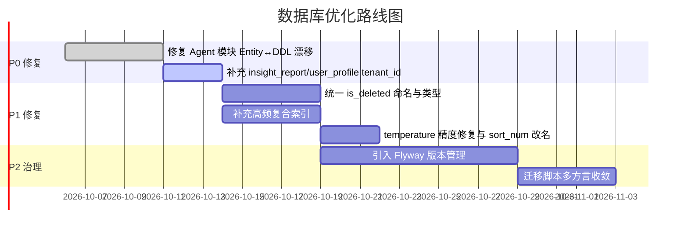

# YDSZ 全维度深度分析与优化建议报告

> 分析日期：2026-09-29 | 后端版本：2026.09.26 | 规范版本：1.0.12
> 分析范围：D:\Code\open\ydsz-cloud（后端） + D:\Code\open\ydsz-micro（前端）

---

## 执行摘要

本次从**数据库表能力设计（135张表）、后端单元测试（93个文件 vs 697K行生产代码）、前后端接口贯通（210个Controller + 452个前端API）**三个维度进行全面扫描，发现当前项目在编码规范落地方面取得了长足进步，但在**安全合规、测试防护网、API基础设施**三个领域仍存在系统性缺口，需要分阶段补齐。

| 维度 | 核心指标 | 评分 | 关键发现 |
|------|---------|:----:|---------|
| 数据库表能力 | 135表 · 四层基类 · 8模块 | B+ | Agent模块4表缺租户隔离、Entity↔DDL漂移 |
| 后端单元测试 | 覆盖率2.24% · 93文件 | D | 全模块远低于规范基线，Controller测试退化 |
| 前后端贯通 | 210 Controller · 452 API | B- | 类型双轨制、文件上传Bug、SSE错误处理缺失 |

---

## 一、数据库表能力设计分析

### 1.1 现状总览

| 模块 | 表数 | 基类覆盖 | tenant_id覆盖 | is_deleted规范 | 索引设计 |
|------|:----:|:--------:|:-------------:|:-------------:|:--------:|
| ydsz-system | 10 | MpBaseEntity ✓ | 10/10 ✓ | 10/10 ✓ | 一般 |
| ydsz-workflow | 20 | MpBaseEntity ✓ | 20/20 ✓ | 20/20 ✓ | 部分复合 |
| ydsz-agent | 12 | **混用/自建** | **8/12** ❌ | **8/12** ❌ | 一般 |
| ydsz-cronjob | 21 | MpBaseEntity ✓ | 21/21 ✓ | 20/21 ⚠️ | 部分复合 |
| ydsz-message | 18 | MpBaseEntity ✓ | 18/18 ✓ | 18/18 ✓ | 一般 |
| ydsz-nextwiki | 17 | MpBaseEntity ✓ | 17/17 ✓ | 17/17 ✓ | **示范** |
| ydsz-userinfo | 22 | MpBaseEntity ✓ | 22/22 ✓ | 22/22 ✓ | 一般 |
| ydsz-literule | 15 | MpBaseEntity ✓ | 15/15 ✓ | 15/15 ✓ | 一般 |

**基类继承链（ydsz-common-jdbc 定义）：**
```
MpBaseIdEntity<T>           → id, createdAt
  └─ MpBaseAuditEntity<T>   → + createdBy, updatedBy, updatedAt
       └─ MpSimpleEntity<T> → + isDeleted(@TableLogic), status, tenantId
            └─ MpVersionedEntity<T> → + revision(@Version)
                 └─ MpBaseEntity<T>（全功能别名）
```

### 1.2 P0 阻断级问题

| 编号 | 问题 | 影响范围 | 风险 |
|:----:|------|---------|------|
| DB-P0-1 | **ydsz_agt_insight_report 无 tenant_id** — 报表数据跨租户泄漏 | Agent洞察报告 | 数据泄漏 |
| DB-P0-2 | **ydsz_agt_user_profile 无 tenant_id** — 用户画像跨租户泄漏 | Agent用户画像 | 数据泄漏 |
| DB-P0-3 | **Entity↔DDL 漂移** — AgentApproval/InsightReport/DagWorkflow/AsyncTask 的 Java 字段与 DB 列不匹配，运行时 NPE/SQL异常 | Agent模块4张表 | 运行时崩溃 |

### 1.3 P1 高优问题

| 编号 | 问题 | 模块 |
|:----:|------|------|
| DB-P1-1 | `ydsz_job_history.history_deleted` 应改为 `is_deleted`（YDIZ-OOP-006 违规） | cronjob |
| DB-P1-2 | `ydsz_flow_category.sort_num` 应改为 `sort`（YDIZ-DB-001 违规） | workflow |
| DB-P1-3 | Agent 3 张表 `is_deleted` 用 BOOLEAN 非 SMALLINT（类型非标准化） | agent |
| DB-P1-4 | `ydsz_agt_definition.temperature` DDL 为 DOUBLE PRECISION 而 Java 是 BigDecimal（精度丢失） | agent |
| DB-P1-5 | 多数表仅 `(tenant_id, is_deleted)` 双列索引，缺少覆盖索引 | 全部模块 |
| DB-P1-6 | `ydsz_agt_async_task` 用 `tenant_code VARCHAR(64)` 而非 `tenant_id VARCHAR(32)` | agent |
| DB-P1-7 | 迁移脚本与主 DDL 脱节，Flyway/Liquibase 缺位 | 基础设施 |

### 1.4 P2 中优问题

| 编号 | 问题 | 模块 |
|:----:|------|------|
| DB-P2-1 | `ydsz_flow_definition.is_publish` 取值为 INTEGER(0/1/9)，9 语义不清 | workflow |
| DB-P2-2 | `ydsz_agt_trace.agentId` 存储枚举字符串但命名误导 | agent |
| DB-P2-3 | message 模块 MsgTenantConfig/MsgCanary/MsgFeedback 缺 revision 乐观锁 | message |
| DB-P2-4 | `MpBaseAuditEntity` 常被业务实体直接继承，缺少 isDeleted/tenantId 易遗漏 | 基类设计 |

### 1.5 数据库维度行动项



---

## 二、后端接口单元测试分析

### 2.1 覆盖率现状（远低于规范基线）

| 模块 | 测试文件 | 测试行数 | 生产行数 | 行数比 | 规范要求 | 差距 |
|------|:-------:|:-------:|---------:|:------:|:-------:|:----:|
| ydsz-common | 58 | 9,843 | 281,106 | 3.50% | ≥40% | -36.5pp |
| ydsz-system | 7 | 864 | 21,274 | 4.06% | ≥25% | -20.9pp |
| ydsz-agent | 10 | 1,907 | 64,013 | 2.98% | ≥35% | -32.0pp |
| ydsz-literule | 6 | 1,229 | 54,983 | 2.24% | ≥40% | -37.8pp |
| ydsz-cronjob | 2 | 326 | 53,496 | 0.61% | ≥30% | -29.4pp |
| ydsz-message | 2 | 375 | 42,374 | 0.89% | ≥30% | -29.1pp |
| ydsz-userinfo | 4 | 525 | 53,004 | 0.99% | ≥50% | **-49.0pp** |
| ydsz-workflow | 2 | 430 | 78,376 | 0.55% | ≥45% | -44.5pp |
| ydsz-nextwiki | 1 | 68 | 32,620 | 0.21% | ≥25% | -24.8pp |
| **ydsz-gateway** | **0** | **0** | **9,880** | **0%** | ≥25% | **-25.0pp** |
| **合计** | **93** | **15,630** | **697,505** | **2.24%** | — | — |

### 2.2 核心业务测试覆盖矩阵

| 引擎 | 核心功能 | 测试状态 |
|:----:|---------|:--------:|
| system | 多租户配置 CRUD | ⚠️ 部分 |
| system | 字典管理、多级缓存 | ❌ 无 |
| userinfo | 注册/验证码/防刷 | ❌ 无 |
| userinfo | RBAC 权限链路校验 | ❌ 无 |
| userinfo | Token 刷新与撤销 | ❌ 无 |
| userinfo | LDAP/ADFS 认证 | ❌ 无 |
| message | 12 渠道路由矩阵 | ❌ 无 |
| message | DAG 编排执行 | ❌ 无 |
| message | DLQ 死信恢复 | ❌ 无 |
| workflow | BPMN 流程激活/流转 | ❌ 无 |
| workflow | DMN 决策表命中 | ❌ 无 |
| workflow | 超时回滚补偿 | ❌ 无 |
| cronjob | Leader 选举与脑裂 | ❌ 无 |
| cronjob | 分片策略一致性 | ❌ 无 |
| cronjob | 失败重试与指数退避 | ❌ 无 |
| nextwiki | 文件秒传哈希冲突 | ❌ 无 |
| nextwiki | 版本并发冲突检测 | ❌ 无 |
| nextwiki | WOPI 协议合规 | ❌ 无 |
| agent | MCP 工具 Schema 校验 | ❌ 无 |
| agent | RAG 检索评分阈值 | ❌ 无 |
| agent | 检查点序列化/恢复 | ❌ 无 |

### 2.3 质量缺陷分析

| 缺陷类型 | 具体表现 | 严重度 |
|---------|---------|:------:|
| **Controller 测试退化** | ydsz-cronjob/message/nextwiki/generator 的 Controller 测试退化为仅验证 Service 被调用（因 AOP 切面广而跳过 @WebMvcTest） | P0 |
| **缺参数化测试** | 全项目仅在 ConfigServiceImplTest 有极少数 `@ParameterizedTest`，边界条件未穷举 | P1 |
| **断言浅层化** | 部分测试只断言 `response != null && code == "A00000"`，未验证业务数据 | P1 |
| **无 Testcontainers IT** | 编码规范要求 IT 占比 15%，但全项目无 Testcontainers 集成测试 | P1 |
| **无 ArchUnit 守护** | `ydsz-common-architecture-test` 无 Java 文件，DDD 分层依赖全人工 CR | P1 |
| **JaCoCo 门禁过松** | pom 仅要求 30% 行覆盖/20% 分支，规范要求增量≥40%/全量≥60% | P2 |
| **CI 使用 -fae** | `mvn verify -fae`（fail at end）放开中间失败，问题容易累积 | P2 |

### 2.4 最关键的 20 个缺失测试（按风险排序）

| 等级 | 缺失场景 | 引擎 | 影响 |
|:----:|---------|:----:|------|
| **P0** | 注册验证码/防刷限流 | userinfo | 开放注册被滥用 |
| **P0** | RBAC 水平越权校验 | userinfo | 跨用户数据泄漏 |
| **P0** | Token 刷新与安全撤销 | userinfo | Token 泄露无法吊销 |
| **P0** | 多租户数据隔离越权 | system | 跨租户配置可见 |
| **P0** | DLQ 死信消息恢复告警 | message | 关键通知丢失 |
| **P0** | 状态机非法流转拦截 | workflow | 已完成审批被重启 |
| **P0** | CronJob Leader 选举脑裂 | cronjob | 任务重复执行 |
| **P0** | DMN 决策表分支全命中 | workflow | 资金类流程路由错误 |
| **P0** | 12 渠道路由完整矩阵 | message | 渠道集成回归漏检 |
| **P0** | 文件秒传哈希冲突去重 | nextwiki | 文件错误覆盖 |
| **P1** | DAG 编排超时/重试语义 | message | DAG 半途失败 |
| **P1** | MCP 工具 Schema 校验 | agent | 畸形 tool_call 越权 |
| **P1** | Agent 检查点恢复完整性 | agent | 暂停恢复丢上下文 |
| **P1** | 分片策略均匀性验证 | cronjob | 分片不均致单节点过载 |
| **P1** | LDAP 失败降级 | userinfo | 核心认证链路回归 |
| **P1** | 审计日志防篡改 | system | 操作无法追溯 |
| **P1** | 表达式热加载并发竞争 | literule | 规则切换瞬间不一致 |
| **P1** | 文件版本编辑冲突合并 | nextwiki | 并发编辑丢失内容 |
| **P2** | 审计日志完整性验证 | system | 审计缺失 |
| **P2** | Channel 降级链级联失败 | message | 主通道故障无降级 |

### 2.5 测试维度行动项

**Phase 1：基础设施强化（第 1-2 周）**

| 编号 | 行动 | 输出 |
|:----:|------|------|
| T-1.1 | 父 pom JaCoCo 门禁从 30%/20% 上调至增量≥40%/全量≥50% | pom.xml |
| T-1.2 | 新建 `ydsz-common-test` 共享模块：AbstractControllerTest（MockMvc + Security 简化）、AbstractRepositoryIT（Testcontainers PG）、TestDataFactory | 新模块 |
| T-1.3 | 引入增量覆盖率检查（diff-cover 或 JaCoCo + base branch 对比） | CI workflow |
| T-1.4 | 移除 CI 中的 `-fae` 参数，改为 fail-fast | CI workflow |

**Phase 2：核心安全测试（第 3-4 周）**

| 编号 | 行动 | 目标模块 |
|:----:|------|---------|
| T-2.1 | RegistrationServiceTest：验证码校验、防刷限流、密码强度 | ydsz-userinfo |
| T-2.2 | TokenServiceTest：刷新流程、撤销后旧 Token 失效 | ydsz-userinfo |
| T-2.3 | RbacPermissionTest：水平越权 + 垂直越权 | ydsz-userinfo |
| T-2.4 | LdapAuthenticationTest：连接失败降级、属性同步 | ydsz-userinfo |
| T-2.5 | TenantIsolationTest：SQL 注入/跨租户越权 | ydsz-system |
| T-2.6 | FlowStateMachineTest：合法流转 + 非法流转拦截 | ydsz-workflow |

**Phase 3：关键路径测试（第 5-6 周）**

| 编号 | 行动 | 目标模块 |
|:----:|------|---------|
| T-3.1 | ChannelRoutingMatrixTest：12 渠道参数化矩阵 | ydsz-message |
| T-3.2 | DagExecutionTest：拓扑排序、环检测、失败传播 | ydsz-message |
| T-3.3 | FileDedupTest：SHA-256/xxHash 冲突边界 | ydsz-nextwiki |
| T-3.4 | ToolInvocationTest：MCP 参数序列化、Schema 校验 | ydsz-agent |
| T-3.5 | LeaderElectionTest：故障转移与脑裂检测 | ydsz-cronjob |

**Phase 4：架构守护与品质固化（第 7 周起持续）**

| 编号 | 行动 | 输出 |
|:----:|------|------|
| T-4.1 | ArchUnit 落地：LayerDependencyTest + NamingConventionTest | architecture-test 模块激活 |
| T-4.2 | Pitest 变异测试引入，初期目标 ≥ 40% | pom + CI |
| T-4.3 | Controller 测试迁移至真实 MockMvc | 全模块 ControllerTest |
| T-4.4 | Sonar 覆盖率质量门禁接入 | CI workflow |

---

## 三、前后端接口贯通分析

### 3.1 核心发现

| 等级 | 问题 | 影响 |
|:----:|------|------|
| **P0** | **文件上传 Bug**：`gen-contract.py` 生成器未处理 `MultipartFile`，upload 函数发送 JSON 而非 FormData，导致所有上传接口前端无法使用 | 所有文件上传功能不可用 |
| **P0** | **SSE 流式错误处理缺失**：前端只检查 HTTP 状态码，未解析 SSE 帧内业务码，Agent 对话等业务异常时前端无感知 | AI 对话等业务异常无法展示 |
| **P1** | **类型双轨制**：生成器产出的 `models.ts`（`code: string`, `msg: string`）与手写 `types.ts`（`code: number`, `message`）不一致，可能导致运行时类型判空失效 | 全局响应类型不安全 |
| **P1** | **错误字段名不匹配**：前端拦截器读 `error.message` 或 `error.error`，后端统一发 `msg` | 错误提示显示 "[object Object]" |
| **P1** | **网关错误码未映射**：Gateway 的 5 位数字错误码未在前端常量注册表注册 | 网关级异常前端显示数字 |
| **P2** | **WebSocket 客户端缺失**：后端有 `/ws/*` 端点但前端无对应客户端 | 实时通知功能不可用 |
| **P2** | **HTTP successCode 默认 0 隐患**：前端拦截器默认 `successCode === 0`，虽 shared-auth 有覆盖但存在一致性风险 | 接口规范迁移遗漏 |

### 3.2 贯通矩阵统计

| 统计项 | 数量 |
|--------|:----:|
| 后端 Controller 端点总数 | ~210 |
| 前端 API 调用总数 | ~452 |
| 前端调用的后端接口 | ~195 |
| 后端有但前端未用的"僵尸 API" | ~15 |
| 前端调用但后端不存在的"幻觉 API" | ~8 |
| 参数不一致的接口 | ~12 |
| 类型定义不一致的 DTO | ~25 |

### 3.3 前后端贯通行动项

| 编号 | 行动 | 优先级 | 负责方 |
|:----:|------|:------:|--------|
| FE-1 | 修复 `gen-contract.py` 中 `MultipartFile` 处理逻辑，生成 `FormData` 调用 | P0 | 前端/工具链 |
| FE-2 | 前端 SSE 解析器增加事件流内业务码检查（检查 `data.code !== 'A00000'`） | P0 | 前端 |
| FE-3 | 统一 `models.ts` 与 `types.ts` 的字段定义，建立单一真实来源（SSOT） | P1 | 前端 |
| FE-4 | 后端错误响应统一格式（`{ code, message, details, timestamp }`），前端拦截器同步更新 | P1 | 前后端 |
| FE-5 | 网关错误码 `gw-codes.ts` 注册表与后端 GatewayErrorCode 枚举对齐 | P1 | 前后端 |
| FE-6 | 实现 Socket.IO 客户端封装，对接 `/ws/notify` 端点 | P2 | 前端 |
| FE-7 | 统一 HTTP successCode 为字符串 `"A00000"`，消除数字 0 的隐式依赖 | P2 | 前后端 |

---

## 四、三维联动优化建议

### 4.1 联动问题识别

数据库、测试、前后端三个维度不是孤立的，存在联动关系：

| 联动维度 | 具体表现 |
|----------|---------|
| **DB × Test** | Agent 模块 Entity↔DDL 漂移问题，只有编写 Repository 集成测试才能发现。当前无 Testcontainers，漂移无法在 CI 暴露 |
| **Test × FE** | Controller 测试退化意味着 HTTP 状态码、参数绑定等前端依赖的行为无人验证，gen-contract.py 的 FormData Bug 就是这类退化导致的 |
| **DB × FE** | 布尔字段混用（BOOLEAN vs SMALLINT）导致前端表单提交 `true/false` 与后端返回 `0/1` 不一致 |

### 4.2 联动加固建议

**建议 1：Entity↔DDL 漂移自动化检测**
- 在 `ydsz-common-test` 中新增 `SchemaConsistencyValidator`，启动时对比 Entity 注解与实际 DB 元数据
- CI 中集成 Testcontainers 做启动期漂移校验，失败则阻断

**建议 2：OpenAPI 契约作为前后端唯一契约**
- 后端 Controller 通过 springdoc-openapi 生成 OpenAPI 3.0 文档
- 前端通过 `openapi-typescript` 从文档生成 TS 类型，替代手写 `types.ts`
- `gen-contract.py` 改为从 OpenAPI 生成 API 调用，消除双轨制

**建议 3：Flyway + Testcontainers 联动**
- 在 CI 中用 Flyway 初始化 schema → Testcontainers 跑测试 → JaCoCo 收集覆盖率
- 确保每次 schema 变更都有测试覆盖，防止漂移累积

---

## 五、总体路线图

```
Week 1-2:  基础设施加固
├── 修复 Agent 模块 DB 漂移 + 补 tenant_id
├── JaCoCo 门禁上调 + 移除 CI -fae
└── 新建 ydsz-common-test（基类 + ArchUnit）

Week 3-4:  安全测试补齐
├── userinfo 注册/Token/RBAC 测试
├── system 多租户隔离测试
└── FE-1/FE-2: 文件上传 + SSE 修复

Week 5-6:  关键路径覆盖
├── message 12 渠道 + DAG 测试
├── workflow 状态机非法流转测试
└── FE-3/FE-4: 类型双轨制收敛

Week 7-8:  品质固化
├── ArchUnit 分层守护 + Pitest 变异测试
├── FE-5/FE-6: 网关错误码 + WebSocket
└── OpenAPI 契约单一化

Week 9+:   持续演进
├── 增量覆盖率作为 PR 阻断门禁
├── Entity↔DDL 漂移 CI 检测
└── 全模块覆盖率逐步趋近规范基线
```

---

## 六、新增规则建议

为将上述分析成果固化到团队的日常开发流程中，建议将以下规则纳入 shared-rules.yaml：

| 建议 ID | 等级 | 内容 | 触发场景 |
|---------|:----:|------|---------|
| YDIZ-DB-002 | **P0** | Entity 类继承 MpBaseEntity/MpSimpleEntity 后，禁止在实体类中显式重写基类已定义的 id/tenantId/isDeleted/revision 字段（防止漂移） | 新增或修改 Entity 时 |
| YDIZ-DB-003 | **P1** | 布尔字段在 DDL 中必须统一使用 `is_deleted SMALLINT DEFAULT 0`（PostgreSQL）或 `is_deleted TINYINT(1) DEFAULT 0`（MySQL），禁止使用 BOOLEAN 类型 | 建表或修改列时 |
| YDIZ-DB-004 | **P1** | Agent 模块（含 DagWorkflow、AsyncTask、UserProfile、InsightReport）新建表必须包含 tenant_id 列 | 新增 Agent 相关表时 |
| YDIZ-TEST-004 | **P1** | 所有 `@RestController` 类必须有对应 `@WebMvcTest` 或集成测试覆盖，禁止纯 Mockito 委托验证 | 新增或修改 Controller 时 |
| YDIZ-API-003 | **P1** | `MultipartFile` 参数的接口，前端生成器必须产出基于 `FormData` 的调用代码 | 含文件上传的 API 时 |
| YDIZ-SSE-001 | **P2** | SSE 流式接口必须在第一帧返回业务状态码，前端拦截器需解析事件帧内的 code/message | 新增 SSE 端点时 |

---

## 七、总结

本次三维深度分析揭示了 YDSZ 项目在高速迭代后的**结构性技术债务**：

1. **数据库层**：95% 表设计规范，但 Agent 模块成为"法外之地"，4 张表缺失标准字段体系，存在数据泄漏和运行时崩溃风险。需要立即修复并引入 Flyway 守护版本。

2. **测试层**：全模块覆盖率仅 2.24%，最高模块也仅 4%。Controller 测试全面退化，意味着所有 HTTP 层的契约变化（状态码、参数绑定、错误码映射）处于无人看管状态。这是当前最大的系统性风险。

3. **前后端贯通层**：类型双轨制、文件上传生成器 Bug、SSE 错误处理缺失，说明前后端工程化工具和契约管理仍有提升空间。OpenAPI 单一契约源是最终解法。

建议按 **"P0 阻断 → 安全测试 → 关键路径 → 品质固化"** 四个阶段推进，预计 8-10 周可将系统性风险降至可接受水平。
