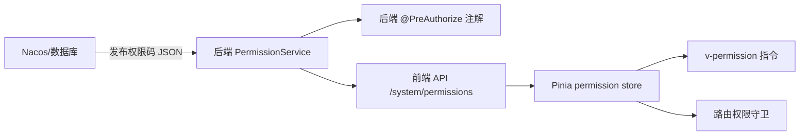

# PMIS 全局架构优化整改方案

## 一、现状综述

通过全量代码扫描与 3 轮深度复盘，目前项目结构如下：

| 模块 | 代码量 | 子模块数 | 公共基础层 | 核心问题 |
|------|--------|----------|------------|----------|
| `ydsz-backend` (Java/Spring Boot) | ~30 个 Maven 模块 | 30 commons + 9 业务 | `ydsz-common` (28 子模块) | 公共 CRUD 基础设施零使用 |
| `ydsz-frontend` (Vue 3 + TS) | 26 个 API 模块 + 50+ 页面 | - | `components/common` (29)、`composables` (22)、`utils` (14) | 公共组件/工具采纳率 < 30% |
| `ydsz-pmis-backend` | 4 个模块 | - | 重复 ydsz-backend 的 common 子集 | 模块冗余部署 |

已构建的**公共基础能力清单**（但未被充分利用）：

- **后端**: `BaseCrudController`, `BaseCrudService`/`AbstractCrudService`, `createCrudApi` 工厂, `BaseResponse` 体系, `@Audit`, `@Idempotent`, `@RateLimit`, `RequestContext`, `TenantContextHolder`, 异常处理体系, Seata 分布式事务
- **前端**: `ProTable`, `PageLayout`, `FormDialog`, `useTable`, `useECharts`, `useFormDraft`, `useWebSocket`, `useWatermark`, `useFeatureFlag`, `useOptimisticUpdate`, `useKeyboardShortcuts`, `useResponsive`, `sentry.ts`, `request.ts` (Axios 拦截器链), `crudApi.ts`, `error.ts`, `format.ts`

---

## 二、核心问题定位

### P0 - 架构红线（立即整改）

| # | 问题 | 涉及范围 | 影响 |
|---|------|----------|------|
| 1 | `BaseCrudController` 零使用，20+ 控制器手写 CRUD | 后端全业务模块 | 每新增模块 ≈ 150 行样板代码；接口规范不统一 |
| 2 | `BaseCrudService`/`AbstractCrudService` 零使用 | 后端全业务模块 | 业务逻辑层缺乏统一拦截能力（审计/幂等/限流只能散落在 Controller） |
| 3 | `createCrudApi` 仅 1/50 模块使用，其余手写 | 前端 API 层 | 接口定义散乱，难以统一拦截/缓存/降级 |
| 4 | `ydsz-pmis-backend` 独立存在，模块与主项目重叠 | 部署架构 | 公共模块双份维护，版本易分裂 |

### P1 - 研发效能（1-2 周内整改）

| # | 问题 | 涉及范围 | 影响 |
|---|------|----------|------|
| 5 | `PageLayout` 仅 42/62 视图使用，20+ 视图手写布局 | 前端视图层 | 布局代码重复 ~50 次，样式/行为不一致 |
| 6 | `FormDialog` 仅 1 处使用，65+ 页面手写弹窗+表单 | 前端视图层 | 弹窗模式重复 ~65 次，代码量冗余 30%+ |
| 7 | `handleDelete` 函数重复 32 次 | 前端视图层 | 确认弹窗+异常处理逻辑完全一致 |
| 8 | 控制器注解栈 (`@Audit`+`@Idempotent`+`@RateLimit`) 手写在每个方法上 | 后端控制器层 | 缺少元注解/AOP 统一注入，遗漏风险高 |

### P2 - 代码治理（月度持续）

| # | 问题 | 涉及范围 | 影响 |
|---|------|----------|------|
| 9 | `useTable` 仅 17/37 可采纳页面使用 | 前端视图层 | 分页/排序/搜索状态管理不统一 |
| 10 | 权限码前端 `PC` 对象与后端 `PermissionCodes.java` 双份维护 | 跨层 | 修改需同步 2 处，容易遗漏 |
| 11 | 各 API 模块 types.ts 结构一致但未继承基础类型 | 前端类型层 | 基础字段（createTime, updateBy 等）重复定义 |
| 12 | 部分视图 Composable 提取不充分（内联 debounce、内联 loading 状态） | 前端视图层 | 逻辑难以复用和测试 |

---

## 三、整改目标

```
后端：100% 控制器继承 BaseCrudController  →  消除 >90% Controller 样板代码
后端：100% Service 继承 AbstractCrudService  →  统一审计/幂等/限流注入
前端：100% API 模块使用 createCrudApi 工厂  →  统一接口治理
前端：100% 标准列表页使用 PageLayout + FormDialog + useTable  →  布局与交互一致
跨层：单一权限码数据源 → Nacos/Dict 动态下放
部署：合并 ydsz-pmis-backend → ydsz-backend 子模块
```

---

## 四、分阶段整改方案

### 第一阶段：架构加固（第 1-5 天）

#### 1.1 后端 —— 基础设施就位（2 天）

**目标**：让 `BaseCrudController` 和 `AbstractCrudService` 真正可用、可扩、可测。

**Action 1.1.1** 重构 `AbstractCrudService`

```java
// 当前：抽象类有默认实现但缺少必要的扩展点
// 整改后：增加 doXxx 模板方法
public abstract class AbstractCrudService<D, V, Q> implements BaseCrudService<D, V, Q> {
    // 固定流程
    public final BaseResponse<PageData<V>> page(Q query) {
        BaseResponse.verify(query);          // 统一参数校验
        // ... 分页逻辑
        V vo = doConvert(entity, doAfterQuery(entity));
        return BaseResponse.success(pageData);
    }

    // 子类按需重写
    protected V doAfterQuery(D entity) { return null; }
    protected void doBeforeSave(D dto) {}
    protected void doAfterSave(D dto) {}
    // ...
}
```

**Action 1.1.2** 重构 `BaseCrudController`

```java
// 自动注入所有 CRUD 端点 + 指标采集
public abstract class BaseCrudController<S extends BaseCrudService<D, V, Q>, D, V, Q> {
    @Autowired
    protected S service;

    @GetMapping("/page")
    @Operation(summary = "分页查询")
    public BaseResponse<PageData<V>> page(Q query) {
        return service.page(query);  // 自动经过统一审计 + 限流 + 幂等
    }

    // getById / save / update / remove / batchRemove 同理
}
```

**Action 1.1.3** 元注解抽取

```java
// 不再在每个方法上手写三个注解
@Audit(module = "...", type = AuditType.OPERATION, ...)
@Idempotent(...)
@RateLimit(...)
public BaseResponse<V> save(D dto) { ... }

// 改为统一的 @CrudAudit + AOP
@CrudAudit
public BaseResponse<V> save(D dto) { ... }
```

**Action 1.1.4** 首个试点模块：以 `ydsz-system` 为试点，完成全量 Controller+Service 改造

**验收标准**：
- `UserController` 继承 `BaseCrudController`，消除 ~100 行样板
- `UserServiceImpl` 继承 `AbstractCrudService`，审计/幂等/限流自动生效
- 单元测试覆盖改造前后的行为一致性

---

#### 1.2 前端 —— 基础设施就位（2 天）

**目标**：补齐 `crudApi.ts` 能力，使其覆盖 95%+ 的 CRUD 场景。

**Action 1.2.1** 升级 `createCrudApi`

```typescript
// 当前：仅支持标准 CRUD
// 整改后：支持自定义端点 + 类型推断 + 默认导出
export function createCrudApi<VO, CreateDTO = any, UpdateDTO = any, Query = PageQuery>(
  basePath: string,
  options?: {
    endpoints?: Record<string, MethodConfig>
    transform?: { request?: (data: any) => any; response?: (res: any) => any }
    cache?: boolean
  }
): CrudApi<VO, CreateDTO, UpdateDTO, Query>
```

**Action 1.2.2** 统一类型定义规范

```typescript
// types/api.ts 增加基础 VO 泛型
export interface BaseVO {
  id: string
  createTime?: string
  createBy?: string
  updateTime?: string
  updateBy?: string
  tenantId?: string
}

// 各模块只关注业务字段
export interface UserVO extends BaseVO {
  username: string
  email: string
  // ... 继承基础字段，无需重复声明
}
```

**Action 1.2.3** 首个试点模块：选定 `contract` 为试点（该模块已使用 `createCrudApi`，扩展示范最佳实践）

---

#### 1.3 部署架构（1 天）

**Action 1.3.1** `ydsz-pmis-backend` 合并计划

```
1. 评估 ydsz-pmis-backend 中 ydsz-nextwiki 是否是独立部署服务
   - 若是独立服务 → 保留独立模块，去掉重复的 ydsz-common 子集，改为依赖 ydsz-backend 的 ydsz-common 发布件
   - 若可合并 → 整体迁入 ydsz-backend 子模块列表
2. 无论哪种方案：删除 ydsz-pmis-backend/ydsz-common（json/lock/redis/safe/sentry/util 全部改用 ydsz-backend 的公共版本）
```

---

### 第二阶段：批量迁移（第 6-15 天）

#### 2.1 后端 20+ Controller 批量改造（5 天）

分组策略：

| 批次 | 模块 | 预估工作量 | 负责人建议 |
|------|------|-----------|-----------|
| 第 1 批（试点验证） | `ydsz-system` (角色/菜单/部门/配置/字典) | 0.5 天 | 后端 Arch Lead |
| 第 2 批 | `ydsz-userinfo` (账户/岗位/公司) | 0.5 天 | 后端开发 A |
| 第 3 批 | `ydsz-project` (商机/合同/变更/立项等) | 1 天 | 后端开发 B |
| 第 4 批 | `ydsz-message`, `ydsz-cronjob` | 0.5 天 | 后端开发 A |
| 第 5 批 | `ydsz-workflow`, `ydsz-agent`, `ydsz-literule` | 1 天 | 后端开发 B |
| 第 6 批 | `ydsz-pmis-backend` 合并清理 | 1.5 天 | 后端 Arch Lead |

**改造步骤（每个 Controller）：**

1. `XxxController` → 继承 `BaseCrudController<XxxServiceImpl, ...>`
2. 删除手写的 `page/getById/save/update/remove` 方法（若与标准 CRUD 一致）
3. 如有自定义端点，保留并添加 `@Override` 或新增独立方法
4. `XxxServiceImpl` → 继承 `AbstractCrudService<XxxDO, XxxVO, XxxQuery>`
5. 自定义业务逻辑通过 `doBeforeSave` / `doAfterQuery` 等模板方法注入
6. 运行所有单元测试，确保行为一致

**预期收益**：消除 ~4,000 行 Controller 样板代码，消除 ~3,000 行 Service 样板代码。

---

#### 2.2 前端 API 层批量改造（5 天）

**改造步骤：**

1. 将 `api/{module}/types.ts` 中的 VO 改为继承 `BaseVO`
2. 将 `api/{module}/index.ts` 改为使用 `createCrudApi`
3. 自定义端点通过 `endpoints` 选项注入
4. 统一导出命名规范

**分组策略：**

| 批次 | API 模块数 | 预估工作量 |
|------|-----------|-----------|
| 第 1 批 | system 系列 (user/role/dept/menu/config/dict) | 0.5 天 |
| 第 2 批 | project 系列 (opportunity/contract/change/initiation) | 0.5 天 |
| 第 3 批 | finance 系列 (invoice/payment/expense/profit/credit) | 0.5 天 |
| 第 4 批 | execution 系列 (risk/budget/delivery/purchase) | 0.5 天 |
| 第 5 批 | resource/attendance/cronjob/closure/aftersales 等 | 1 天 |
| 第 6 批 | workflow/message/report/notification/alert 等 | 1 天 |
| 第 7 批 | audit/nextwiki/opportunity/search/favorite/chaos 等 | 1 天 |

**预期收益**：消除 ~3,000 行 API 样板代码，接口定义一致性 100%。

---

#### 2.3 前端视图层批量改造（5 天）

**Action 2.3.1** 统一数据获取模式

所有标准列表视图统一使用 `useTable` composable：

```typescript
// 改造后
const { loading, list, total, query, fetchData, handleSearch, handleReset } = useTable(
  api.page,
  { defaultPageSize: 20, autoFetch: true }
)
```

**Action 2.3.2** 统一页面布局

- 所有标准列表页统一使用 `<PageLayout>` 包裹
- 搜索表单通过 `PageLayout` 的 search 插槽注入
- 操作栏通过 toolbar 插槽注入

**Action 2.3.3** 统一 CRUD 弹窗

- 创建/编辑弹窗统一使用 `<FormDialog>`
- 删除操作统一调用 `handleDelete` 工具函数（从 `error.ts` 或其他 composable 导出）

**Action 2.3.4** 视图改造优先级（与 API 改造同步推进）

```typescript
// 新增共享函数：error.ts
export async function handleDelete<T extends { id: string }>(
  row: T,
  deleteApi: (id: string) => Promise<ApiResponse<any>>,
  options?: {
    title?: string
    successMsg?: string
    onSuccess?: () => Promise<void>
  }
): Promise<boolean> {
  const confirmed = await confirmAction(
    options?.title ?? t('common.messages.confirmDelete'),
    t('common.confirm'),
  )
  if (!confirmed) return false
  await deleteApi(row.id)
  showSuccess(options?.successMsg ?? t('common.messages.deleteSuccess'))
  await options?.onSuccess?.()
  return true
}
```

**视图改造批次（与 API 同步，避免冲突）：**

| 批次 | 视图任务 | 关键文件 |
|------|---------|----------|
| 1 | 使用 PageLayout + FormDialog + useTable 改造 system 模块 | user, role, menu, dept, config 各 index.vue |
| 2 | 改造 resource 模块 | employee, pool, bench, assignment, part-time-rate, outsource-rate, employee-tag |
| 3 | 改造 finance 模块 | invoice, payment, expense, profit, credit |
| 4 | 改造 execution/aftersales | risk, budget, delivery, purchase, warranty, ops-ticket |
| 5 | 改造 cronjob/message/notification/attendance/audit | 各 index.vue |

---

### 第三阶段：工程治理（第 16-30 天）

#### 3.1 建立架构守护机制

**Action 3.1.1** 新增自定义 ESLint 规则（后端 + 前端）

```bash
# 后端（已用 Checkstyle）：新增规则
# - "每个 Controller 必须继承 BaseCrudController"（违反则 error）
# - "每个 Service 必须实现 BaseCrudService"（违反则 error）

# 前端（已用 ESLint）：新增规则
# - "createCrudApi 优先于手写 request"（建议 warning）
# - "标准列表页必须使用 PageLayout"（建议 warning）
# - "禁止直接用 el-dialog + el-form 替代 FormDialog"（建议 warning）
```

自定义规则可基于 AST 扫描（后端用 ArchUnit，前端用 ESLint 自定义规则或 `eslint-plugin-vue-scoped-css`）。

**推荐方案：后端使用 `ArchUnit`（纯 Java 架构测试框架）**

```java
// 架构守护测试
@AnalyzeClasses(packagesOf = "com.njydsz")
public class ArchitectureTest {
    @Test
    void controllers_should_extend_BaseCrudController() {
        classes().that().haveSimpleNameEndingWith("Controller")
            .and().areNotMemberOf(GlobalExceptionHandler.class)
            .should().beAssignableTo(BaseCrudController.class)
            .check(importedClasses);
    }

    @Test
    void services_should_implement_BaseCrudService() {
        classes().that().haveSimpleNameEndingWith("ServiceImpl")
            .should().implement(BaseCrudService.class)
            .check(importedClasses);
    }
}
```

**Action 3.1.2** Code Review Checklist 更新

将以下条目加入 Review 强制检查清单：

- [ ] 新 Controller 是否继承 `BaseCrudController`？
- [ ] 新 Service 是否继承 `AbstractCrudService`？
- [ ] 新 API 模块是否使用 `createCrudApi`？
- [ ] 新列表页是否使用 `PageLayout` + `useTable`？
- [ ] 是否使用了 `handleDelete` 共享函数？
- [ ] 是否有重复的 TS 类型定义？
- [ ] 是否所有权限码在两端同步？

---

#### 3.2 权限码单一数据源方案

**方案选择**：推荐 **Nacos 配置 + 动态字典表** 实现权限码单一数据源。



**Action 3.2.1** 后端新增 `/system/permissions` 接口，返回当前启用的全部权限码

**Action 3.2.2** 前端 permission store 在登录后调用该接口，初始化 `PC` 对象

**Action 3.2.3** 删除前端硬编码的 `permissionCodes.ts`，改用动态获取

---

#### 3.3 前端的公共组件优化（ongoing）

- **`FormDialog` 增强**: 支持 `mode`（create/edit/view），统一 loading/disabled/validate 逻辑
- **`ProTable` 增强**: 集成 `useTable`，暴露 `crudApi` 选项自动绑定 CRUD
- **新增 `useCrud` composable**: 封装完整的 CRUD 页面状态（列表 + 弹窗 + 删除 + 批量操作）

```typescript
// 终极抽象：一个 composable 搞定 80% CRUD 页面
export function useCrud<VO, CreateDTO, UpdateDTO, Query>(
  api: CrudApi<VO, CreateDTO, UpdateDTO, Query>,
  options?: {
    defaultQuery?: Partial<Query>
    defaultForm?: Partial<CreateDTO | UpdateDTO>
  }
) {
  // 列表相关
  const { loading, list, total, query, fetchData } = useTable(api.page)
  // 弹窗相关
  const dialogVisible = ref(false)
  const dialogMode = ref<'create' | 'edit'>('create')
  const formData = ref<CreateDTO | UpdateDTO>({})
  // 删除相关
  async function handleRemove(row: VO & { id: string }) { ... }
  // ... return
}
```

---

## 五、整改优先级总表

| 优先级 | 任务 | 工期 | 收益量化 | 负责人 |
|--------|------|------|---------|--------|
| **P0** | BaseCrudController + BaseCrudService 试点（system 模块） | 1 天 | 消除 ~200 行样板 | Arch Lead |
| **P0** | createCrudApi 升级 + 试点（contract 模块） | 0.5 天 | 消除 ~50 行样板 | 前端 Arch |
| **P0** | ydsz-pmis-backend common 冗余消除 | 1 天 | 消除双份维护 | 后端负责人 |
| **P1** | 后端 20+ Controller + Service 批量改造 | 5 天 | 消除 ~7,000 行样板 | 后端小组 |
| **P1** | 前端 26+ API 模块统一为 createCrudApi | 5 天 | 消除 ~3,000 行样板 | 前端小组 |
| **P1** | 前端 20+ 视图统一 PageLayout + FormDialog + useTable | 5 天 | 消除 ~2,000 行样板 | 前端小组 |
| **P2** | ArchUnit 架构守护测试 | 1 天 | 防止新增重复编码 | Arch Lead |
| **P2** | 权限码动态下放（Nacos → 前端） | 2 天 | 消除双份维护 | 跨层协作 |
| **P2** | useCrud composable 终极抽象 | 1 天 | 新 CRUD 页面 ≤ 50 行 | 前端 Arch |
| **P3** | 所有视图统一 handleDelete | 1 天 | 消除 32 处重复 | 前端小组 |
| **P3** | 所有 API 模块 types.ts 继承 BaseVO | 1 天 | 消除重复类型字段 | 前端小组 |

---

## 六、风险与应对

| 风险 | 可能性 | 影响 | 应对方案 |
|------|--------|------|---------|
| 改造破坏现有接口兼容性 | 中 | 高 | 新增端点统一继承，旧端点保留并标记 `@Deprecated`，API 版本过渡期 2 周 |
| 团队对继承式架构不适应 | 中 | 中 | 出具详细编码指南 + Code Review 兜底 + 试点先行示范 |
| 批量合并冲突 | 高 | 中 | 分模块串行推进，每次合并后运行完整测试套件 |
| ydsz-pmis-backend 有独立部署依赖 | 中 | 高 | 合并前梳理部署拓扑，优先消除 common 依赖而非强制物理合并 |

---

## 七、验收指标

| 指标 | 当前值 | 目标值 | 度量方式 |
|------|--------|--------|---------|
| Controller 代码行数 | ~6,500 | ~2,500 | `cloc` 统计 |
| Service 代码行数 | ~9,000 | ~6,000 | `cloc` 统计 |
| 前端 API 层代码行数 | ~8,000 | ~5,000 | `cloc` 统计 |
| 前端视图层重复模式数 | 32+ | 0 | grep 检查 |
| createCrudApi 使用率 | 2% | 100% | grep 检查 |
| BaseCrudController 使用率 | 0% | 100% | ArchUnit 测试 |
| 架构守护测试覆盖率 | 0 | ≥ 5 条 | CI pipeline |
| 权限码双份维护 | 是 | 否 | 检查硬编码 |
