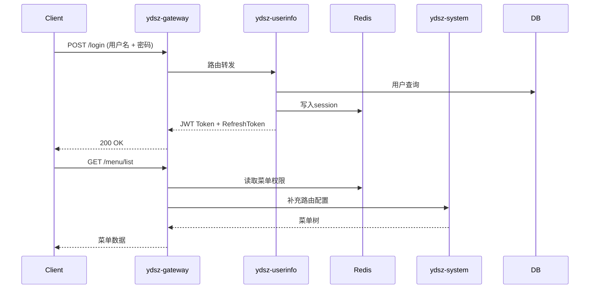

# 性能基线方案（Performance Baseline Plan）

> **文档版本**：1.0
> **生效日期**：2026-09-08
> **适用范围**：ydsz-cloud 全部 9 个部署单元 + 网关
> **关联模块**：ydsz-gateway、ydsz-system、ydsz-userinfo、ydsz-workflow、ydsz-generator、ydsz-literule、ydsz-message、ydsz-cronjob、ydsz-agent、ydsz-nextwiki

---

## 1. 背景与目标

### 1.1 当前问题

项目目前已建立完整的 CI 流水线（含 Checkstyle、JaCoCo 覆盖率、单元测试），但缺乏量化的性能评估体系，具体表现为：

- **无历史基线数据**：每次发布无法判断性能是否劣化
- **无压测环境**：性能问题依赖生产环境暴露，修复代价高
- **无自动化门禁**：CI 中缺少性能回归阈值判定
- **无统一压测数据集**：各开发人员的测试数据随机，结果不可复现

### 1.2 目标

| 指标 | 目标值 | 说明 |
|------|--------|------|
| 核心 API P99 响应时间 | < 200ms | 覆盖登录、菜单加载、列表查询等高频接口 |
| QPS 峰值余量 | 5 倍日常峰值 | 应对突发流量，如早高峰集中登录 |
| 5xx 错误率 | < 0.1% | 在 2000 并发持续 30 分钟场景下 |
| CPU 利用率 | < 70% | 在 P99 目标下 CPU 不出现瓶颈 |
| DB 连接池利用率 | < 50% | 连接池大小配置合理，避免排队等待 |

---

## 2. 关键性能指标（KPI）

### 2.1 吞吐量（Throughput）

| 缩写 | 含义 | 采集方式 |
|------|------|----------|
| TPS | Transactions Per Second（每秒事务数） | JMeter / k6 聚合报告 |
| QPS | Queries Per Second（每秒查询数） | Prometheus `http_server_requests_seconds_count` |

### 2.2 响应时间（Latency）

| 分位值 | 含义 | 用途 |
|--------|------|------|
| P50（中位数） | 50% 请求的响应时间 | 表征"典型用户体验" |
| P95 | 95% 请求的响应时间 | 发现长尾异常 |
| P99 | 99% 请求的响应时间 | **性能门禁核心指标** |

采集方式：Micrometer 直方图（`Percentile` 时间窗口 = 10s），Prometheus 通过 `histogram_quantile(0.99, rate(...))` 计算。

### 2.3 错误率（Error Rate）

| 指标 | 计算方式 | 阈值 |
|------|----------|------|
| 5xx 占比 | `5xx 请求数 / 总请求数` | < 0.1% |
| 超时比例 | `timeout 请求数 / 总请求数` | < 0.05% |
| 业务异常比例 | `code != 200 响应占比` | < 2% |

### 2.4 资源利用率（Resource Utilization）

| 资源 | 监控指标 | 目标值 |
|------|----------|--------|
| CPU | `process_cpu_usage` | < 70% |
| 内存 | `jvm_memory_used_bytes` | < 80% maxHeap |
| 数据库连接池 | `hikaricip_connections_active / hikaricip_connections_max` | < 50% |
| Redis 连接 | `lettuce_command_latency` P99 | < 5ms |
| JVM GC 暂停 | `jvm_gc_pause_seconds` P99 | < 50ms |
| 线程池队列 | `ydsz_thread_pool_queue_size` | 持续 = 0 |

---

## 3. 压测方案设计

### 3.1 工具选型

| 工具 | 用途 | 适用场景 | 集成方式 |
|------|------|----------|----------|
| **Apache JMeter 5.6** | 初测与功能压测 | 复杂场景编排（含参数化、断言、Cookie 管理） | 独立部署，GUI 模式编写脚本，CLI 模式执行 |
| **wrk2** | 网关层极限压测 | 验证 Gateway 纯路由转发能力，排除业务逻辑干扰 | CI 流水线调用，输出 latency distribution |
| **Grafana k6** | CI 集成性能门禁 | 每次 PR 合并前自动执行，输出 JSON 报告比对基线 | GitHub Actions Step，使用 `@grafana/k6-reporter` 生成 HTML |

### 3.2 压测场景

#### 场景 A：登录 + 菜单加载

模拟用户登录后的初始页面渲染触发的高频操作链。



- **并发用户数**：1000
- **循环次数**：每用户执行 3 轮（模拟多次刷新）
- **断言**：响应码 = 200，responseTime < 150ms

#### 场景 B：代码生成器 CRUD

验证 ydsz-generator 的 CRUD 操作及模板渲染性能。

- **接口链路**：创建数据源 → 表逆向工程 → CRUD 代码生成 → 下载 ZIP
- **并发用户数**：500
- **特殊考量**：Velocity 模板渲染涉及 IO，需监控磁盘写入延迟

#### 场景 C：工作流状态机流转

验证 ydsz-workflow 的 BPMN 2.0 状态机引擎在高并发流转下的稳定性。

- **操作链**：发起流程 → 提交审批 → 审批节点流转 → 补偿回调 → 归档
- **并发用户数**：300
- **事务保证**：每个流转操作需验证 Seata TCC 事务完整性

#### 场景 D：多租户上下文切换

验证 ydsz-common-tenant 在 SINGLE / MULTI / ISOLATE_DB 三种隔离级别下的性能差异。

- **操作**：在同一并发批次中混合三种租户隔离级别，随机租户 ID 查询
- **并发用户数**：2000
- **关键判定**：ISOLATE_DB 模式下连接池扩容延迟应 < 500ms

### 3.3 数据集

| 数据实体 | 规模 | 说明 |
|----------|------|------|
| 租户（tenant） | 1000 | 三种隔离级别按 6:3:1 比例分布 |
| 用户（user） | 10000 | 每租户平均 10 用户，含角色绑定 |
| 角色（role） | 5000 | 每租户平均 5 角色，含权限树 |
| 菜单（menu） | 20000 | 每租户 20 菜单项 |
| 流程定义（process_def） | 500 | 100 种流程定义 × 5 版本 |
| 数据字典（dict_data） | 50000 | 每租户 50 条字典记录 |

初始化脚本位置：`scripts/data-gen/mock-data-generator.sql`
生成工具：使用 JMeter `__RandomString` 配合 Python 批量生成

---

## 4. 压测执行流程

### 4.1 环境准备

```
┌──────────────────────────────────────────────────────────────────┐
│                      独立压测集群（PT-Cluster）                     │
│                                                                    │
│  ┌─────────┐  ┌─────────┐  ┌─────────┐  ┌─────────────────────┐ │
│  │ Nacos   │  │ RDS     │  │ Redis   │  │ RocketMQ / MinIO   │ │
│  │ 2.4+    │  │ PG 16   │  │ 7.x 集群│ │ (按需)             │ │
│  └─────────┘  └─────────┘  └─────────┘  └─────────────────────┘ │
│                                                                    │
│  ┌──────────────────────────────────────────────────────────┐     │
│  │  被测服务（镜像与生产 1:1 同构，CPU/Memory 配额相同）       │     │
│  │  ydsz-gateway / ydsz-system / ... / ydsz-agent           │     │
│  └──────────────────────────────────────────────────────────┘     │
│                                                                    │
│  ┌──────────────────────────────┐                                 │
│  │  压测执行机（压测工具 + Agent）│                                 │
│  │  JMeter Controller + Worker  │                                 │
│  └──────────────────────────────┘                                 │
└──────────────────────────────────────────────────────────────────┘
```

关键原则：压测集群与开发/测试环境物理隔离，避免压测流量干扰日常开发。

### 4.2 数据预热

压测开始前执行以下预热操作，消除冷启动偏差：

1. **Redis 预填充**：
   - 租户路由映射（`tenant:route:{tenantId}`）
   - 菜单权限缓存（`menu:perm:{roleId}`）
   - 数据字典（`dict:code:{dictCode}`）
   - 会话黑名单 BloomFilter
2. **JVM 预热**：启动后轻量请求 500 次，触发 JIT 编译
3. **连接池预热**：HikariCP 执行 `connectionTestQuery` 验证连接就绪

### 4.3 梯度加压

```
并发数
  ^
  │                        ┌─────────── 2000（持续 30 分钟）
  │                ┌───────┘
  │            ┌───┘        ← 1000（持续 20 分钟）
  │        ┌───┘
  │    ┌───┘                ← 500（持续 15 分钟）
  │ ┌──┘
  │─┘                      ← 100（持续 10 分钟，预热阶段）
  └─────────────────────────────────────────────> 时间
  0     10    25    40    60    80    110 (分钟)
```

各梯度阶段需采集：TPS 曲线、响应时间分布、错误率、CPU/Memory 趋势。

### 4.4 结果收集

| 来源 | 采集方式 | 存储 |
|------|----------|------|
| 压测工具原始结果 | `.jtl` 文件（JMeter）、`summary.json`（k6） | CI Artifact / S3 |
| 服务端指标 | Prometheus `thanos-query` 抓取（步长 15s） | Prometheus TSDB（保留 90 天） |
| GC 日志 | `-Xlog:gc*:file=gc.log` | 对象存储 |
| 线程Dump | `jstack`（异常时触发） | ELK |
| 慢 SQL | `log_min_duration_statement = 1000`（PG） | PG 日志 → Loki |

### 4.5 报告生成

- **压测报告**：k6 使用 `@grafana/k6-reporter` 或 `jtl-reporter` 生成 HTML 报告
- **趋势图**：Grafana 提供近 N 次压测的趋势对比面板
- **结论摘要**：自动计算本次结果与基线的偏差百分比，输出 Pass/Fail

---

## 5. 性能门禁（Quality Gate）

### 5.1 CI 集成配置

在 `.github/workflows/performance-gate.yml` 中新增：

```yaml
name: Performance Gate
on:
  push:
    branches: [main, develop]
  pull_request:
    types: [labeled]  # 仅在打上 'perf-test' 标签时触发

jobs:
  k6-baseline:
    runs-on: ubuntu-latest
    services:
      # 启动测试依赖容器（Redis、Nacos 等）
      ...
    steps:
      - uses: actions/checkout@v4
      - name: Run k6 baseline
        run: |
          k6 run \
            --tag build=${{ github.run_number }} \
            --out json=results.json \
            tests/perf/login-baseline.js
      - name: Compare with baseline
        run: python scripts/perf/compare-baseline.py results.json
```

### 5.2 回归判定规则

| 指标 | 基线值 | 阈值（新版超过基线） | 判定 |
|------|--------|----------------------|------|
| P99 响应时间 | 150ms | > 150ms × 1.10（即 165ms） | 退化（Warning） |
| P99 响应时间 | 150ms | > 150ms × 1.25（即 187.5ms） | 严重退化（Block PR） |
| 5xx 错误率 | 0.05% | > 0.1% | Block PR |
| TPS 相对下降 | 基线 TPS | < 基线 × 0.90 | Warning |
| CPU 利用率 | 60% | > 80% | Warning |

### 5.3 阈值更新机制

- 当新版本性能显著优于基线时（> 10% 提升），由技术委员会评审后更新基线文件
- 基线文件存储位置：`docs/performance/baseline-values.json`
- Git Tag 压测通过的基线值标记为 stable，不可覆盖需显式升级

---

## 6. 压测结果记录表模板

> 以下为空模板，每次压测后由各模块负责工程师填写。

### 6.1 总览

| 字段 | 值 |
|------|-----|
| 压测编号 | PT-YYYYMMDD-NNN |
| 执行日期 | YYYY-MM-DD |
| 执行人 | 姓名 |
| 被测版本 | Git SHA 或 Tag |
| 压测集群规格 | 如 8C16G × 5 节点 |
| 数据集规模 | 租户 / 用户 / 角色 |
| 总请求数 | — |
| 总耗时 | — |

### 6.2 场景 A：登录 + 菜单加载

| 并发数 | TPS | P50(ms) | P95(ms) | P99(ms) | 5xx 数 | 5xx% | CPU% | Mem% |
|--------|-----|---------|---------|---------|--------|------|------|------|
| 100 | — | — | — | — | — | — | — | — |
| 500 | — | — | — | — | — | — | — | — |
| 1000 | — | — | — | — | — | — | — | — |
| 2000 | — | — | — | — | — | — | — | — |

### 6.3 场景 B：代码生成器 CRUD

| 并发数 | TPS | P50(ms) | P95(ms) | P99(ms) | 5xx 数 | 5xx% | CPU% | Mem% |
|--------|-----|---------|---------|---------|--------|------|------|------|
| 100 | — | — | — | — | — | — | — | — |
| 500 | — | — | — | — | — | — | — | — |
| 1000 | — | — | — | — | — | — | — | — |
| 2000 | — | — | — | — | — | — | — | — |

### 6.4 场景 C：工作流状态机流转

| 并发数 | TPS | P50(ms) | P95(ms) | P99(ms) | 5xx 数 | 5xx% | CPU% | Mem% |
|--------|-----|---------|---------|---------|--------|------|------|------|
| 100 | — | — | — | — | — | — | — | — |
| 500 | — | — | — | — | — | — | — | — |
| 1000 | — | — | — | — | — | — | — | — |
| 2000 | — | — | — | — | — | — | — | — |

### 6.5 场景 D：多租户上下文切换

| 并发数 | TPS | P50(ms) | P95(ms) | P99(ms) | 5xx 数 | 5xx% | CPU% | Mem% |
|--------|-----|---------|---------|---------|--------|------|------|------|
| 100 | — | — | — | — | — | — | — | — |
| 500 | — | — | — | — | — | — | — | — |
| 1000 | — | — | — | — | — | — | — | — |
| 2000 | — | — | — | — | — | — | — | — |

### 6.6 资源利用摘要

| 服务 | 节点数 | CPU avg | CPU peak | Mem avg | Mem peak | DB Conn avg | GC pause P99 |
|------|--------|---------|----------|---------|----------|-------------|-------------|
| ydsz-gateway | — | — | — | — | — | N/A | — |
| ydsz-userinfo | — | — | — | — | — | — | — |
| ydsz-system | — | — | — | — | — | — | — |
| ydsz-workflow | — | — | — | — | — | — | — |
| ydsz-generator | — | — | — | — | — | — | — |
| ydsz-literule | — | — | — | — | — | — | — |
| ydsz-message | — | — | — | — | — | — | — |
| ydsz-cronjob | — | — | — | — | — | — | — |
| ydsz-agent | — | — | — | — | — | — | — |
| ydsz-nextwiki | — | — | — | — | — | — | — |

---

## 7. 附录

### 7.1 修订历史

| 版本 | 日期 | 修订人 | 内容 |
|------|------|--------|------|
| 1.0 | 2026-09-08 | 架构组 | 初始版本，定义性能基线方案与压测框架 |

### 7.2 参考文档

- [云顶版本规范](./../云顶版本规范.md)
- [云顶编码规范](./../云顶编码规范.md)
- [本地开发环境](./../本地开发环境.md)
- [K6 官方文档](https://k6.io/docs/)
- [Apache JMeter 最佳实践](https://jmeter.apache.org/usermanual/best-practices.html)
