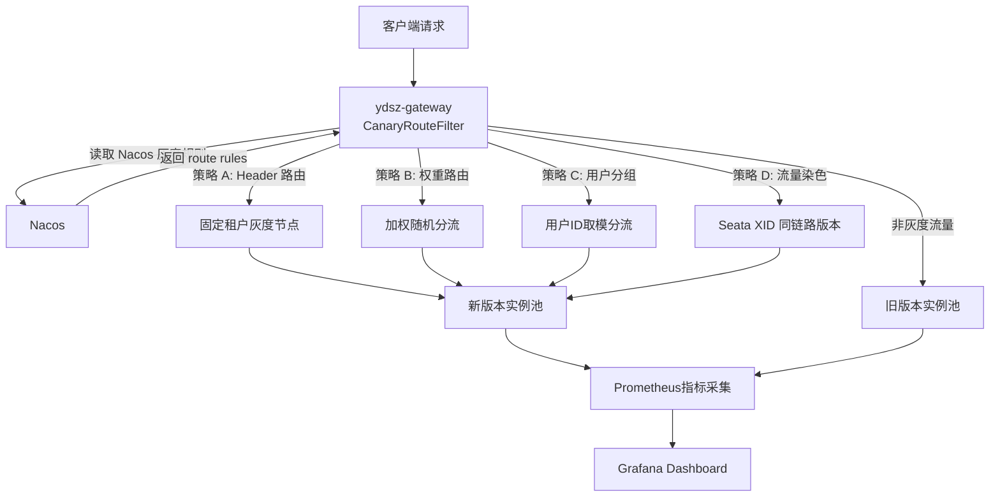

# 灰度发布架构设计（Canary Release Architecture）

> **文档版本**：1.0
> **生效日期**：2026-09-08
> **适用范围**：ydsz-cloud 全部灰度发布场景
> **技术栈**：Spring Cloud Gateway 2025.1.2 + Nacos 2.4+ + Seata 2.x + Prometheus + Grafana

---

## 1. 背景与目标

### 1.1 当前问题

项目目前采用全量发布模式（通过 CI/CD 直接部署全部节点），存在以下风险：

- **故障爆炸半径大**：新版本若有未发现的缺陷，瞬间影响全部用户
- **回滚速度慢**：全量部署后发现问题，需要重新构建旧版本并重新部署，平均恢复时间 > 30 分钟
- **验证不充分**：测试环境无法完全模拟生产流量特征，灰度发现是唯一低成本验证手段
- **数据迁移风险**：DDL 变更一旦发布，回滚需要同时回滚数据库结构

### 1.2 目标

| 维度 | 目标 | 说明 |
|------|------|------|
| 灰度粒度 | 支持租户级、用户级、比例级 | 可按业务重要性分级灰度 |
| 发布安全 | 灰度阶段异常影响 < 1% 用户 | 快速止损 |
| 回滚速度 | < 3 分钟完成回滚 | 权重归零 + 熔断触发 |
| 数据兼容 | 灰度期间 DDL 变更零故障 | 所有 DDL 必须向后兼容 |
| 可观测性 | 灰度指标实时 Dashboard | Grafana 面板秒级刷新 |

---

## 2. 灰度策略



### 2.1 策略 A：Header 路由（固定租户灰度）

**原理**：请求携带固定 Header `X-Canary: <tenant-id>`，网关匹配后固定转发到灰度版本。

| 配置项 | 类型 | 说明 |
|--------|------|------|
| `canary.header-key` | String | 灰度标识 Header 名，默认 `X-Canary` |
| `canary.header-whitelist` | List<String> | 租户 ID 白名单，匹配即走灰度版本 |

**适用场景**：
- 内部团队功能验收
- 特定大客户提前验证新功能
- A/B 测试中的定向观察组

### 2.2 策略 B：权重路由（比例分流）

**原理**：网关层实现加权随机算法，按配置的权重比例将请求分流。

| 配置项 | 类型 | 说明 |
|--------|------|------|
| `canary.weight.canary` | Integer | 灰度版本权重（0-10000，精度 0.01%） |
| `canary.weight.stable` | Integer | 稳定版本权重 |

**适用场景**：
- 通用灰度发布（按流量比例渐进放量）
- 性能对比实验（同数据、同负载、不同版本对比）

**实现伪代码**：

```java
// CanaryRouteFilter 核心逻辑
int random = ThreadLocalRandom.current().nextInt(10000);
if (random < canaryWeight) {
    exchange.getAttributes().put(GATEWAY_REQUEST_URL_ATTR, canaryUri);
}
```

### 2.3 策略 C：用户分组（ID 取模分流）

**原理**：基于用户 ID 取模运算，将用户均匀分配到灰度或稳定组。

| 配置项 | 类型 | 说明 |
|--------|------|------|
| `canary.user-hash.mod` | Integer | 取模基数，默认 10000 |
| `canary.user-hash.threshold` | Integer | 阈值，取模结果 < threshold 则走灰度 |

**适用场景**：
- 确保同一用户始终命中同一版本（避免会话漂移）
- 新版功能逐步开放给特定用户群体

**注意事项**：JWT 中需解析 `userId`，网关层需支持 JWT payload 的无加密解析（仅读取声明，不验证签名）。

### 2.4 策略 D：流量染色（Seata XID 同链路版本一致性）

**原理**：在 Seata XID（全局事务 ID）中携带灰度标签，确保同一事务链路内的所有跨服务调用命中同一版本。

| 配置项 | 类型 | 说明 |
|--------|------|------|
| `canary.seata.enabled` | Boolean | 是否启用 Seata XID 灰度传播 |
| `canary.seata.tag-key` | String | XID 中灰度标签键名 |

**适用场景**：
- 分布式事务场景（如下单 → 扣库存 → 支付 → 发货）
- 需要确保 TCC / SAGA / AT 事务链路上版本一致，避免接口不兼容导致事务失败

---

## 3. 技术实现

### 3.1 Spring Cloud Gateway 过滤器

在 `ydsz-gateway` 中新增 `CanaryRouteFilter`：

```
ydsz-gateway/
└── src/main/java/com/njydsz/gateway/filter/
    └── CanaryRouteFilter.java    # 灰度路由核心过滤器
```

过滤器职责：
1. 从 Nacos 配置中心订阅灰度路由规则（`ydsz-canary-rules` dataId）
2. 按优先级匹配策略（Header → 权重 → 用户分组 → Seata 标签）
3. 根据匹配结果将请求路由到对应的 ServiceInstanceListSupplier
4. 将灰度结果写入 MDC 和响应头 `X-Canary-Version`

### 3.2 Nacos 配置中心规则存储

```yaml
# Nacos Data ID: ydsz-canary-rules
# Group: GRAY_RULES
# Refresh: Spring Cloud Nacos 配置自动订阅

canary:
  enabled: true
  rules:
    - strategy: HEADER
      priority: 1
      config:
        header-key: X-Canary
        whitelist:
          - "tenant-001"
          - "tenant-002"
          - "tenant-demo"

    - strategy: WEIGHT
      priority: 2
      config:
        canary: 500      # 5% = 500/10000
        stable: 9500     # 95%

    - strategy: USER_HASH
      priority: 3
      config:
        mod: 10000
        threshold: 500   # 前 5% 用户

    - strategy: SEATA_TAG
      priority: 4
      config:
        enabled: true
        tag-key: "canary_tag"
        stable-tag: "stable"
        canary-tag: "canary"
```

### 3.3 数据库兼容性（DDL 向后兼容原则）

灰度发布期间必然存在新旧版本同时访问数据库的情况，所有 DDL 变更必须遵守以下规则：

| 操作 | 是否允许 | 说明 |
|------|----------|------|
| 新增列（nullable + default） | 允许 | `ALTER TABLE ... ADD COLUMN col VARCHAR(64) DEFAULT 'default_value'` |
| 新增索引（CONCURRENTLY） | 允许 | `CREATE INDEX CONCURRENTLY ...` |
| 新增表 | 允许 | 无旧版本依赖 |
| 修改列类型 | 禁止 | 旧版本无法解析新类型 |
| 删除列 | 禁止 | 旧版本读写会报错 |
| 修改列约束 | 禁止 | 可能违反旧版本写入逻辑 |
| 重命名表/列 | 禁止 | 需先添加别名过渡一个版本 |

**执行步骤**（两阶段 DDL 部署）：
1. **Pre-deploy Phase**：先执行 N 个 DDL 变更（均向后兼容），部署并验证
2. **Deploy Phase**：部署新版本业务代码，利用新增的列/表/索引
3. **Post-deploy Phase**：新版本稳定运行 1 周后，再清理废弃列/表

### 3.4 回滚策略

| 触发条件 | 动作 | 耗时 |
|----------|------|------|
| 灰度版本错误率 > 1%（连续 30s） | 自动将灰度权重降为 0 | < 10s |
| 灰度版本 P99 > 基线 200% | 自动切换全部流量到旧版本 | < 10s |
| 熔断器打开（Resilience4j） | 降级走旧版本 | 立即 |
| 人工触发回滚 | MCM 一键回滚按钮 | < 3min |
| 数据库连接池耗尽（灰度版本） | 下线灰度实例 | 由 K8s 自动处理 |

---

## 4. 监控与告警

### 4.1 灰度关键指标看板

Dashboard 配置文件：`docs/release/grafana-canary-dashboard.json`

需采集的核心面板：

| 面板名称 | 查询表达式 | 告警阈值 |
|----------|-----------|----------|
| 灰度 vs 旧版对比 QPS | `sum(rate(http_server_requests_seconds_count{...}[1m])) by (canary_version)` | — |
| 灰度版本 P99 | `histogram_quantile(0.99, rate(http_server_requests_seconds_bucket{canary_version="canary"}[1m]))` | > 200ms |
| 旧版版本 P99 | `histogram_quantile(0.99, rate(http_server_requests_seconds_bucket{canary_version="stable"}[1m]))` | > 150ms |
| 灰度错误率 | `sum(rate(http_server_requests_seconds_count{canary_version="canary",status=~"5.."}[1m])) / sum(rate(http_server_requests_seconds_count{canary_version="canary"}[1m]))` | > 1% → 触发回滚 |
| 灰度版本 CPU | `avg(process_cpu_usage{canary_version="canary"})` | > 80% |
| 灰度 vs 旧版 TPS 差值 | `abs(delta())` | 差值 > 20% 触发观察 |

### 4.2 告警规则

```yaml
# Prometheus Alertmanager 规则
groups:
  - name: canary_alerts
    rules:
      - alert: CanaryHighErrorRate
        expr: |
          sum(rate(http_server_requests_seconds_count{canary_version="canary",status=~"5.."}[1m]))
          / sum(rate(http_server_requests_seconds_count{canary_version="canary"}[1m])) > 0.01
        for: 30s
        labels:
          severity: critical
        annotations:
          summary: "灰度版本 5xx 错误率超过 1%"
          action: "建议立即将灰度权重置 0"

      - alert: CanaryHighLatency
        expr: |
          histogram_quantile(0.99, rate(http_server_requests_seconds_bucket{canary_version="canary"}[1m]))
          > 0.3
        for: 2m
        labels:
          severity: warning
        annotations:
          summary: "灰度版本 P99 响应时间超过 300ms"

      - alert: CanaryRapidRollback
        expr: |
          canary_weight{job="ydsz-gateway"} == 0 and canary_weight offset 5m > 0
        for: 0m
        labels:
          severity: info
        annotations:
          summary: "灰度权重已归零，可能是自动回滚触发"
```

### 4.3 日环比对比

每天 08:00 自动生成灰度对比日报，通过企微/邮件推送给相关人员：

| 对比项 | 旧版（昨日） | 灰度版（今日） | 偏差 |
|--------|-------------|---------------|------|
| 日均 QPS | — | — | — |
| P99 响应时间 | — | — | — |
| 5xx 错误总数 | — | — | — |
| 平均 CPU 利用率 | — | — | — |
| 慢 SQL 数量（>1s） | — | — | — |

---

## 5. 灰度发布 SOP（标准作业程序）

### 阶段 0：发布前准备

| 步骤 | 负责人 | 内容 | 耗时 |
|------|--------|------|------|
| 0.1 | 开发 | 确认 DDL 变更已通过兼容性审核 | 1h |
| 0.2 | 开发 | 确认新增配置项设有默认值 | 30min |
| 0.3 | 测试 | 测试环境完成全量回归测试 | 4h |
| 0.4 | 架构 | 确认灰度监控 Dashboard 已部署 | 1h |
| 0.5 | DBA | 数据库 DDL 预执行（在压测环境验证语法） | 30min |

### 阶段 1：内部开发环境验证

```
环境：dev（影响范围：内部开发团队）
流量：全部指向灰度版本
时长：不少于 4 小时
观察指标：功能完整性、单元测试通过率、日志无 ERROR
通过标准：无 P0/P1 级别问题
```

### 阶段 2：1% 流量灰度

```
环境：生产环境
Nacos 配置：canary.weight.canary = 100（1%）
观察时长：至少 24 小时
观察指标：
  - 灰度版本 5xx 错误率 < 0.1%
  - 灰度版本 P99 < 200ms
  - 灰度版本 CPU < 70%
通过标准：连续 12 小时所有指标正常
```

### 阶段 3：渐进放量

```
┌─────────────┬──────────┬──────────────┬──────────────────────────┐
│ 子阶段       │ 灰度比例  │ 最短观察期    │ 通过标准                    │
├─────────────┼──────────┼──────────────┼──────────────────────────┤
│ 3.1         │ 10%      │ 48h          │ 错误率 < 0.5%，P99 < 200ms │
│ 3.2         │ 25%      │ 48h          │ 同上                        │
│ 3.3         │ 50%      │ 48h          │ 同上                        │
│ 3.4         │ 100%     │ —            │ 全量后进入阶段 4             │
└─────────────┴──────────┴──────────────┴──────────────────────────┘
```

### 阶段 4：全量发布 + 旧版保留

```
操作：
  - 将旧版本容器保留为"热备"状态（不接收流量，但处于 Ready）
  - 保留时长：72 小时
  - 72h 后确认无异常，销毁旧版本实例

回滚预案：
  - 若 72h 内发现严重问题：Nacos 配置 canary.weight.stable = 10000, canary = 0
  - 灰度版本容器自动缩容，旧版本接管全量流量
```

### 阶段 5：发布后清理

| 步骤 | 内容 | 触发条件 |
|------|------|----------|
| 5.1 | 销毁旧版本容器实例 | 阶段 4 完成后 72h |
| 5.2 | 更新 CHANGELOG.md，记录发布结果 | 全量发布当天 |
| 5.3 | 清理废弃配置项（若上一版本已标记 deprecated） | 下一个发布周期 |
| 5.4 | 更新性能基线文件（若新版本性能表现显著变化） | 发布评审会确认 |

---

## 6. 数据一致性保障

灰度发布涉及新旧版本同时运行，需特别注意以下数据场景：

| 场景 | 风险 | 缓解措施 |
|------|------|----------|
| 新写数据被旧版读取 | 新列补 null 值被旧版误判 | 新列使用合适 default 值 |
| 旧版写入数据被新版读取 | 缺失新列导致 NPE | 新列 nullable + 业务层 null check |
| Seata 分布式事务 | 旧版无法解析新版 XID 格式 | XID 标签向后兼容，旧版忽略未知字段 |
| Redis 缓存 Key | 新版写入 Key 格式变更，旧版读不到 | Key 迁移期间双写，或清空缓存重建 |
| 异步 MQ 消息 | 反序列化失败导致堆积 | 消息体新增字段需兼容旧 schema |

---

## 7. 附录

### 7.1 修订历史

| 版本 | 日期 | 修订人 | 内容 |
|------|------|--------|------|
| 1.0 | 2026-09-08 | 架构组 | 初始版本，定义灰度发布架构与 SOP |

### 7.2 参考文档

- [性能基线方案](./../performance/baseline-plan.md)
- [云顶版本规范](./../云顶版本规范.md)
- [本地开发环境](./../本地开发环境.md)
- [Spring Cloud Gateway 官方文档](https://docs.spring.io/spring-cloud-gateway/reference/)
- [Seata 灰度方案参考](https://seata.apache.org/docs/user/saga/)
