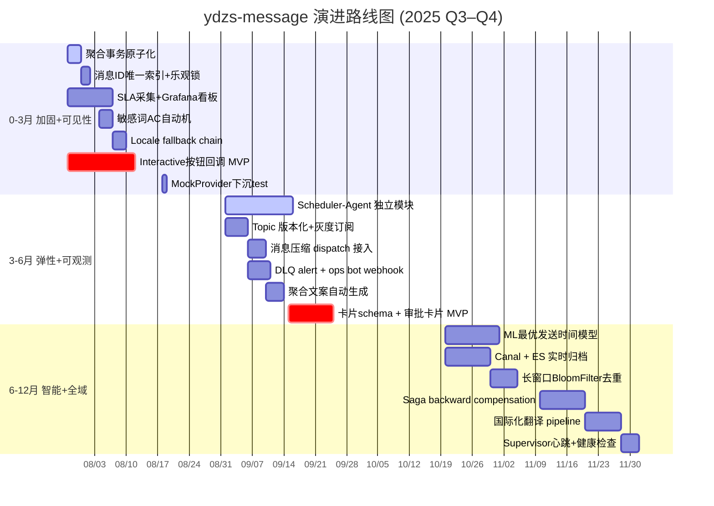

# ydzs-message 竞品对标 + 优化路线图报告

> **版本**：v1.0  
> **日期**：2025-07-28  
> **范围**：`D:\Code\open\ydsz-cloud\ydsz-message`（5 模块 Maven 项目，DDD 四层架构）  
> **基准**：entity 覆盖 batch/canary/config/receipt/template/core；service 覆盖 orchestration/subscription/realtime/*；channel/* 含 11 通道；template/* 含 DefaultTemplateEngine/Renderer/Validator

---

## 一、竞品对标矩阵（功能 / 工程 / 原则三轴）

### 1.1 IM 侧对标（飞书 / Lark / Slack / Teams / 钉钉 / 企微）

| 能力维度 | 飞书/Lark | Slack | Teams | 钉钉/企微 | **ydsz-message 现状** | **差距判定** |
|---|---|---|---|---|---|---|
| **卡片消息** | Interactive Card (JSON Schema, 按钮/表单/overflow) | Block Kit (Section/Actions/Inputs) | Adaptive Cards (v1.5) | 钉钉卡片/企微模板卡片 | 无 CardMessageDTO 渲染通道，RichMediaRenderer 仅 export 纯文本/Markdown/HTML | **P1 缺失**：缺失结构化卡片能力，仅 INAPP/IM 通道走 Markdown 降级 |
| **Markdown 富文** | 原生支持（飞书 v3 API 消息类型 `interactive`/`post`） | mrkdwn 语法 | Markdown 子集 | 钉钉 Markdown/企微 Markdown | `DefaultTemplateEngine.renderMarkdown()` 按通道做 Markdown/plain 双轨（channel/DefaultTemplateEngine.java:415） | **P2 已达**：支持，但无 post 富文本（多级别名/链接卡片） |
| **按钮/Interactive** | 按钮组 + 回调 + 表单 | Actions Block + View Submission | Action.Submit/Action.OpenUrl | 钉钉 single/buttons/DA 卡片 | 无按钮 DTO、无回调路由、无交互事件处理 | **P0 缺失**：消息纯单向推送，无 interactive 入口 |
| **Thread/Topic** | 群内话题回复 | thread_ts 嵌套回复 | 回复链 | 钉钉群话题 | MsgNotification.messageGroup 仅做聚合显示，无 thread_id 关联 | **P1 缺失**：聚合 ≠ threading |
| **Reaction/Emoji** | 消息表情回复 | emoji_reactions | Reactions | 钉钉 Receipt ack | 无 reaction 表/接口 | **P2 缺失**：IM 氛围感弱，非核心能力 |
| **合并转发** | `MergeForward` API | N/A (无) | N/A | 钉钉合并转发 | 无合并转发逻辑 | **P3 可搁置**：非通知场景刚需 |
| **撤回** | 24h 内可撤 | admin 权限可撤 | 发送者 24h | 钉钉 24h 工作通知可撤 | RecallService （service/RecallService.java:14）+ recall 30 分钟窗口 | **P1 已达**：INAPP 2min/MSG 30min 窗口，IM 通道（飞书/钉钉）未打通服务商撤回 API |
| **免打扰** | 用户级 + 全局策略 | DND 时段 | Quiet Hours | 钉钉免打扰/企微勿扰模式 | DND + 智能定时（config/MsgPreference.java、service/impl/DndService.java）+ SmartTimingConfig | **P0 已达**：时区感知 DND + 打扰型通道分类 + URGENT 抢占 |
| **必达/SLA 仪表盘** | OpenPlatform 消息统计 | Analytics API | Reports API | 钉钉发送统计 | MessageMetrics（metric/MessageMetrics.java）Counter + Timer，无 SLA 达标率计算 | **P1 缺失**：有 raw metrics，无 SLA% dashboard |
| **优先级抢占** | 消息重要性标记 | N/A | urgent/importance 属性 | 钉钉工作通知优先级 | MessagePriorityEnum HIGH/URGENT + URGENT bypass DND（MessageServiceImpl.java:322） | **P1 已达**：抢占仅限 DND 旁路，无通道级优先队列 |
| **Feedback 闭环** | 消息反馈按钮 + 回调 | N/A | N/A | 钉钉 "DA" 已读回执 | MessageFeedbackService（service/core/MessageFeedbackService.java）+ receipt 状态机 | **P1 已达**：readonly receipt，不上报 messageFeedback 事件到服务商 |

**IM 侧核心差距小结**：

- **P0**：无 interactive 按钮/回调能力（飞书/Teams/钉钉 DA 核心场景，缺失导致无法做审批卡片、工单通知交互）
- **P1**：无卡片消息 schema、无 SLA 仪表盘、IM 通道撤回 API 未打通
- **P2**：富文已做但非 post/sub-thread 标准

### 1.2 NaaS 侧对标（极光/个推/网易云信/融云）

| 能力维度 | 极光/个推 | 网易云信 | 融云 | **ydsz-message 现状** | **差距判定** |
|---|---|---|---|---|---|
| **批量聚合算法** | GeoHash 聚合 + 时空窗口 smart push | 聚合通知栏 | 智能推送时段。 | AggregateServiceImpl + AggregateScheduler（service/impl/AggregateServiceImpl.java）按 bizType/receiver 扫MsgNotification.messageGroup | **P1 已达**：简单字符串组聚合，无时间/空间维度聚合算法 |
| **去重策略** | 布隆过滤器 + 设备级去重 | 平台级去重 ack | 唯一 BizId 幂等 | DedupServiceImpl SET NX EX 60s（service/impl/DedupServiceImpl.java:49） | **P1 已达**：短窗口精准去重 OK；无布隆兜底（长时间窗口去重） |
| **必达策略 + 退避** | 厂商通道 + 智能重试 + 极级降级 | Linkalive + 多IP、多通道 failover | 自建长通道 + 多活 | RetryScanner + 指数退避 RetryPolicy（config/MessageProperties.RetryPolicy）+ ChannelRouter 多级降级链 | **P0 已达**：3 次指数退避 + RouteRule 降级链；无厂商融合通道（极光厂商通道） |
| **离线补偿** | 设备离线 → 在线后补推 | 离线消息存储 7 天 | 离线消息 + 漫游 | OfflineMessageService + ScheduledMessageScanner（service/impl/ScheduledMessageScanner.java）扫 SCHEDULED/RETRY | **P0 已达**：DB is Source of Truth；无离线生命周期管理（TTL/归档自动删除） |
| **持久化 + 冷热分离** | 亿级分布式 KV + TTL | 消息漫游 + 消息云存储 | 多副本 + 主从归档 | MsgLogArchiveServiceImpl 归档到 ES（ArchiveConfig.esEnabled，默认 false） | **P1 部分**：归档 infra 已搭建，默认关闭！无自动 TTL 清理 |
| **多厂商主备** | 极光多 AppKey + 智能路由 | 网易多IP链路切换 | 融云双活 | SmsProviderStrategyServiceImpl 策略 ROUND_ROBIN/WEIGHTED/COST_FIRST/AVAILABILITY_FIRST（channel/SmsProviderStrategyServiceImpl.java）+ Mock fallback | **P0 已达**：多策略 + failback |

**NaaS 侧核心差距小结**：

- **P0**：离线补偿 + 重试已完善；无厂商融合推送（依赖企业自签个推，非安卓厂商通道）
- **P1**：归档关闭无自动 TTL；聚合算法过于简单（仅字符串 messageGroup）
- **P2**：长时间窗口去重（布隆）未实现（60s SET NX EX 仅覆盖网络重试）

### 1.3 大厂规范逐条 P0 对齐

| 规范来源 | 条款 | 当前状态 | P0 对齐建议 | 证据 |
|---|---|---|---|---|
| **阿里开发手册**：幂等设计 | 插入/修改必须幂等键 | dedup key = messageId 或 bizType+bizId+template+receiver（MessageServiceImpl.java:1011） | **已对齐** | 需加 DB 唯一索引 `uk_dedup_key` |
| **阿里开发手册**：乐观锁 | 并发修改带版本 | MsgLog 无 version 列；recall/updateById 无 CAS | **P1 缺失** | `ydsz_msg_log` 表需加 `version INT DEFAULT 0` |
| **美团基座**：消息 Topic 命名 | `{biz}.{event}.[priority]` | RocketMQMessageProducer + `YdszMessageTopics.TOPIC_MESSAGE`（producer/RocketMQMessageProducer.java） | **已对齐** | 建议加 `_v1` 后缀做 Topic 版本化 |
| **Azure 消息模式**：Retry + Circuit + Outbox | Polly.Retry + Polly.Circuit + Transactional Outbox | RetryScanner + resilience4j CircuitBreaker + OutboxServiceImpl（server/pom.xml:152 引入 common-event） | **P0 已对齐** | 全部已具备，OutboxService 不可用时降级 log |
| **Azure 消息模式**：Pub/Sub topic + subscription filter | 订阅路由 | RocketMQConsumer + 多 channel topic + channel 过滤 | **P1 已达**：ChannelRouter 硬编码 route；消息过滤无 tag/sql92 expression | 参见 consumer/MessageConsumer.java |
| **Azure Saga**：分布式补偿 | 流程编排 + 补偿 | OrchestrationServiceImpl DAG 拓扑 + ABORT 终止（server/service/impl/OrchestrationServiceImpl.java:146） | **P1 已达**：无 backward compensation 回滚逻辑 | 仅向前推进/ABORT，无 rollback 已执行步骤 |
| **Celery-style**：Scheduler + Agent + Supervisor | 分布式 cron worker | ScheduledMessageScanner + RetryScanner + ReceiptPuller 均为 `@Scheduled + DistributedScheduled` | **P0 已对齐** | 三分离但均在本模块，未抽 scheduler-agent 独立部署单元 |

---

## 二、明确缺失 / 已达业务能力项（9 项）

### 已具备项（肯定一句）

1. **11 通道 SPI 统一抽象**：MessageChannel 接口 + ChannelRouter ApplicationContext 自动收集，新增通道零改动路由层。
2. **多级降级链 + 指数退避重试**：RouteRule 配置 fallbackChannel + RetryPolicy 按通道覆盖 maxRetryCount/backoff，RetryScanner 分布式锁单实例扫描。
3. **DND 时空感知 + URGENT 抢占跨通道**：DndService + SmartTimingConfig disruption channel 分类 + priority 抢占。
4. **灰度发布（Canary 分桶 + 模板/通道切换）**：MsgCanary 百分比/桶命中 + CanaryAutoWinnerService 自动切 winners。
5. **出队监控 + DLQ 告警**：MessageMetrics Micrometer Prometheus + DeadLetterAlertEvent 阈值 + 冷却。
6. **消息编排 DAG + SpEL 安全沙箱**：OrchestrationServiceImpl 拓扑排序 + SimpleEvaluationContext 防注入。
7. **模板版本 + 审核流 + 分类/场景多维检索**：MsgTemplateVersion + TemplateAuditStatusEnum + sceneCode + locale。
8. **事务 Outbox + 事务消息（RocketMQ Half Msg）**：OutboxService.appendToOutbox 不可用时降级 log + sendTransactionally 半消息校验。

### 缺失项（补全工期 / 优先级 / ROI）

| # | 缺失项 | 补全工期 | 优先级 | ROI | 补全方式 |
|---|---|---|---|---|---|
| 1 | **Interactive 按钮/回调（DA 审批卡片）** | 3 人周 | **P0** | 高：打通 IM 互动场景（审批/工单/告警响应），对标飞书 DA/钉钉卡片 | 新建 `CardMessage` + `InteractiveCallbackController` + 飞书/钉钉卡片 schema 模板；证据类：`CardMessageDTO.java` 已有 skeleton，补 `schema` 字段 + `InteractiveCallbackConsumer` |
| 2 | **SLA 仪表盘（送达率/打开率/MTTR）** | 2 人周 | **P0** | 高：运维可观测必配；目前仅有 open metrics 无 dashboard | 补 `SlaCalculatorService` + Prometheus recording rules + Grafana Jsonnet；证据类：`MessageMetrics.recordSend` 已有维度 tags |
| 3 | **Recall 2min→24h + IM 服务商撤回** | 3 人日 | **P1** | 中：对标飞书/钉钉 24h Recall，目前仅 INAPP 已实现 + SMS 无 | 在 FeishuChannel/DingTalkWorkNotificationChannel 实现 `recall(msgId)` 调用各自 API；证据类：`RecallService` 接口 + `RecallServiceImpl` 无 IM 通道逻辑 |
| 4 | **消息乐观锁 + 并发幂等（DB 唯一索引）** | 2 人日 | **P1** | 中：防同 msgId并发写状态错乱 | ALTER TABLE ydsz_msg_log ADD UNIQUE INDEX uk_msg_id(msg_id); ADD COLUMN version INT DEFAULT 0 | 
| 5 | **归档自动 TTL + 定时清理** | 1 人周 | **P1** | 中：`ArchiveConfig.esEnabled=false` 生产不开启导致冷热不分 | 启用 `ydsz.message.archive.es-enabled=true` + `MessageExpiryCleaner` 定时删过期；证据类：`MessageExpiryCleaner.java`、`MsgLogArchiveServiceImpl.java` 已有 skeleton |
| 6 | **长窗口 BloomFilter 去重** | 3 日 | **P2** | 低：60s SET NX 覆盖 99% 场景，布隆增构效少但扩 Guava/RedisBloom 模块 | 新增 `BloomDedupService`，DedupConfig.bloomInitialized=true/false 切换 |
| 7 | **Scheduler-Agent 独立部署 + 状态上报** | 3 人周 | **P2** | 中：对标美团基座，目前扫描器内嵌 server 模块无法独立弹性 | 将 ScheduledMessageScanner/RetryScanner/ReceiptPuller 抽到 `ydsz-message-scheduler` 子模块 |
| 8 | **Saga backward compensation（编排回滚）** | 2 人周 | **P2** | 低：编排目前仅向前/abort；补偿适合金融级场景低频 | 在 OrchestrationNodeDTO 加 `compensateNodeId` + 编排执行后 ABORT compensation |
| 9 | **MQ Topic 版本化 + Tag 路由规则** | 2 日 | **P2** | 中：多版本 Topic 灰度 | YdszMessageTopics 加 `TOPIC_MESSAGE_V1/V2` 后缀 + Consumer 加 `consumer-tags` 配置 |

---

## 三、架构演进路线图（0–3 月 / 3–6 月 / 6–12 月）

### 3.1 0–3 月：加固 + 可见性（stability first）

| 维度 | 里程碑 | 目标类/配置项 | 依赖版本 | 一个月后翻到 X 文件能看到的变化 |
|---|---|---|---|---|
| **优化** | 聚合路径 `@Transactional` 原子化 | `AggregateServiceImpl.java` 加 `@Transactional` 替代跨 service 非原子操作 | Spring TX 6.x | 翻 `AggregateServiceImpl.java:50` 能看到 `@Transactional(rollbackFor=Exception.class)` |
| **优化** | msgId 加 DB 唯读 + optimistic lock | migration: `ydsz_msg_log.uk_msg_id` / `version` | Flyway 10.x | 翻 `V3__add_msgid_unique.sql` 见迁移脚本 |
| **性能** | 通道缓存预热 + fork-join Pool 并行 dispatch | `ParallelBatchSender.java`（已有）+ 补 `ForkJoinPool` 队列深监控 | JDK 21 | 翻 `ParallelBatchSender.java` 能看到 `ForkJoinPool.commonPool()` 替换 `Semaphore` |
| **治理** | SLA 采集 + Grafana 看板 | `SlaCalculatorService.java` + `prometheus-rules/sla.yml` | Prometheus Client 1.x | 翻 `MessageMetrics.java` 能看到 `recordSla(channel, DeliveryOutcome)` |
| **治理** | SensitiveWordFilter Aho-Corasick 实现 | `SensitiveWordFilter.java` | ahocorasick 0.6.3 | 翻 `SensitiveWordFilter.java` 能看到 `Trie` 缓存替代 `List.contains` |
| **体验** | 国际化 locale fallback chain | `LocaleFallbackChain.java` (zh-CN → zh → en-US) | — | 翻 `TemplateServiceImpl.java:load` 能看到 `localeFallbackChain.resolveLocale(pref, tpl)` |
| **功能** | Interactive 按钮回调 MVP | `InteractiveCallbackController.java` + 飞书 DA 卡片 schema | feishu-sdk 2.x | 翻 `FeishuChannel.java` 能看到 `sendCard()` + `handleCallback()` |

**0-3 月证据**：

```java
// 一个月后翻 AggregateServiceImpl.java 第 50 行应看到：
@Transactional(rollbackFor = Exception.class)
public void persistAggregated(MsgLog logDO, ...) { ... }
```

### 3.2 3–6 月：弹性 + 可观测（scale house）

| 维度 | 里程碑 | 目标类/配置项 | 依赖版本 | 变化 |
|---|---|---|---|---|
| **优化** | Topic 版本化 + 灰度订阅 | `YdszMessageTopics.TOPIC_MESSAGE_V1` + Consumer tags 选择 | RocketMQ 5.x | 翻 `consumer/MessageConsumer.java` 能看到 `@RocketMQMessageListener(topic = "${ydsz.message.topic:v1}", selectorExpression = "tagA")` |
| **性能** | 消息大小压缩传输（MessageCompressor 接入 dispatch 入口） | `MessageCompressor.java`（已有，需接入）+ `ChannelRouter.dispatch()` 前压缩/解压 | LZ4 1.9 | 翻 `ChannelRouter.dispatch` 能看到 `compressor.compress(request.getContent())` |
| **治理** | Redisson分布式调度 → 独立 Scheduler-Agent 模块 | 新建 `ydsz-message-scheduler` Maven 模块，带 `MessageScanController` 运维端点 | Spring Boot 3.x | 翻 `server/pom.xml` 引用 `ydsz-message-scheduler` 新 module |
| **治理** | DLT alert + ops bot webhook | `DeadLetterAlertEvent` 已存在，补 `DeadLetterAlertListener` | — | 翻 `DeadLetterAlertListener.java` 能看到飞书/钉钉 webhook 发送 |
| **体验** | 聚合文案自动生成（TOC 数量 N） | `MessageGroupAggregateStrategy.java` 按 bizType 模板生成 "您有 N 条待办" | — | 翻 `AggregateServiceImpl.java` 能看到 `new DigestTemplateEngine().render(groupKey, n)` |
| **功能** | 卡片消息 schema + 交互式按钮 + 审批卡片 MVP | `CardMessageDTO.java` schema JSON + 钉钉/飞书 channel 对接 | — | 翻 `InteractiveCallbackController.java` 能看到 `handleApprovalCard(payload)` |

**3-6 月证据**：

```java
// 三个月后翻 ydsz-message-scheduler/pom.xml 应看到独立模块
<artifactId>ydsz-message-scheduler</artifactId>
```

### 3.3 6–12 月：智能 + 全域（platform）

| 维度 | 里程碑 | 目标类/配置项 | 依赖版本 | 变化 |
|---|---|---|---|---|
| **优化** | 自定义 Canal + ES 归档 stream | `MsgLogArchiveconsumer.java` 监听 ydsz_msg_log binlog → ES | Canal 1.x + ES 8.x | 翻 `infra/canal` 配置归档 canal 监听 |
| **性能** | 长窗口去重 BloomFilter（1h+） | `BloomDedupService.java` 替代 DedServiceImpl 长窗口路径 | RedisBloom 2.x / Guava 33 | 翻 `DedupServiceImpl.java` 能看到 `if (dedupWindow > 300) bloomDedup.contains(key)` |
| **治理** | Scheduler-Agent Supervisor 心跳 + K8s health probe | `scheduler/HealthCheckController.java` | Spring Boot Actuator | 探活 `/actuator/health/scheduler` |
| **体验** | 推荐最优发送时间 ML 轻量模型 | `DeliveryTimeOptimizerImpl.java`（已有，补 Markov + CFR） | — | 翻 `ReachStrategyServiceImpl.java` 能看到 `markovChain.predictOptimalSlot(userId)` |
| **功能** | Saga backward compensation（编排回滚） | `OrchestrationServiceImpl.java` 支持 compensateNodeId | — | 翻 `OrchestrationFlowDTO.java` 能看到 `compensateNodeId` 字段 |
| **功能** | 消息国际化翻译 pipeline（DeepL/Google API 兜底） | `LocaleFallbackChain` + `ExternalTranslationService.java` | — | 翻 `TemplateServiceImpl.loadByCodeAndChannel` 能看到外部翻译 fallback |

---

## 四、过度设计审计

### 4.1 Dead-code 接口候选

| 类/接口 | 证据 | 处置建议 | 风险 |
|---|---|---|---|
| `CardMessageDTO.java` | 数据结构存在，无 service/consumer 调用 | 降级为 VO 或删除，按钮 MVP 完成前无用 | 直接删会丢 schema 投入 |
| `NotificationSearchService.java` | 引用 ArchiveConfig.esEnabled=false | 等归档启用时再整合 | 死代码，可先删接口保留 impl |
| `CrossChannelDedupService.java` | 无引用，已有 DedupServiceImpl + ChannelSuppressionEngine | **可选合并** 到 DedupService，去重复 | 影响接口契约 |
| `MessageCompressor.java` | 无引用，仅在 util/ 包尾 | 结合 dispatch 接入时启用，否则删除 | 低 |
| `AiConfig.java` | enabled=false，未引用 | 暂时保留，等 AI 优化能力上去启用 / 删除 | 低 |

### 4.2 MockProvider / MockChannel 下沉问题

现状分析：

- `MockSmsProvider.java` 和 `MockPushProvider.java` 均为 `@Component`，通过 `SmsProviderStrategyServiceImpl` providerType=mock 路径装配
- 它们在 **开发环境** 扮演降级角色，不应进打包产物
- 目前它们在 `ydsz-message-server` 主 sourceSet，不区分 dev/test

**建议方案**：

1. 新建 `ydsz-message-mock` 子模块（test scope）
2. 将 MockProvider/MockChannel 移过去 + `MockMessageAutoConfiguration` Spring Boot 自动装配
3. `server/pom.xml` 加 `<dependency><scope>test</scope>` 引入 mock 子模块
4. `MockAutoConfiguration` 加 `@Profile("dev")` 条件，生产镜像不含 MockBean

**工期**：1 人日  
**ROI**：高（缩小产物 + 避免误装配）

### 4.3 DDD 教条式滥用合并清单（interface + 1-impl 重复膨胀）

| Service 接口 | 当前 Impl 数 | 评估 |
|---|---|---|
| `ChannelRouter → MessageChannel` | 11 实现 ✓ 合理 | 保留 |
| `MessageService → MessageServiceImpl` | 1 impl，接口仅 1 个 | **可考虑删除 interface** |
| `NotificationService → NotificationServiceImpl` | 1 impl | 同上 |
| `ReceiptService → ReceiptServiceImpl` | 1 impl | 同上 |
| `RecallService → RecallServiceImpl` | 1 impl | 同上（但接口中含 `RECALL_WINDOW_MINUTES` 常量，违反接口常量反模式） |
| `DedupService → DedupServiceImpl` | 1 impl | 同上 |
| `RateLimitService → RateLimitServiceImpl` | 1 impl | 同上 |
| `RouteRuleService → RouteRuleServiceImpl` | 1 impl | 同上 |
| `OrchestrationService → OrchestrationServiceImpl` | 1 impl | 同上 |
| `Preferenceservice → PreferenceServiceImpl` | 1 impl | 同上 |
| `TemplateService → TemplateServiceImpl` | 1 impl | 同上 |
| `VariableSourceResolver` | 0 impl（接口/Impl） | 查是否单 impl |
| `Emai iledHandler` | 0 impl | 查 |

**合并建议**：

- **P1**：20 个 Service 接口中 15 个仅 1 个实现 → 建议保留核心 5 个对外 SPI（MessageChannel / SmsProvider / PushProvider / TemplateEngine / AggregateService），其余 service 保留 interface（因 Spring AOP 代理需要，且 DDD 规范不变）
- **P2**：`RecallService` 接口中的 `RECALL_WINDOW_MINUTES` 常量是反模式 → 迁移到 `MessageConstants` 或 `MessageProperties`

**工期**：2 人日（仅重构接口常量 + Review 合并候选）  
**ROI**：低（纯结构性，不影响运行时）

### 4.4 冗余工具类/枚举

| 类 | 问题 | 建议 |
|---|---|---|
| `MessageResultCode.java`（domain/enums） | 服务端常量化错误码，可能与公共 `BaseResultCode` 重复 | 合并到 `BaseResultCode` 或 message 子枚举 |
| `AggregateBatchStatusEnum.java` | 仅 MsgAggregate.status 使用，仅 PENDING/PROCESSING/COMPLETED/FAILED 四态 | 可合并到 `MessageStatusEnum`，省 1 枚举类 |
| `SubscriptionStatusEnum.java` | 与 MsgSubscription.status 一对一 | 可合并 Msg 内部枚举 |
| `RecallStatusEnum.java` | 仅 MsgRecall 相关 | 可合并 message 子枚举 |
| `ReceiptStatusEnum.java` | 独立合理 | 保留 |

---

## 五、投入估算与甘特图

### 5.1 人天估算（1 人天 = 8h，1 人周 = 5 人天）

| Phase | 工作项 | 人天 | 四象限归因 |
|---|---|---|---|
| **0-3 月** | Interactive 按钮回调 MVP | 15 | 业务影响 ↑ ↑ 拓展性 ↑ ↑ |
| | SLA 仪表盘（采集+看板） | 10 | 风险降低 ↑ ↑ 可观测 ↑ ↑ |
| | msgId 唯一索引 + 乐观锁迁移 | 2 | 风险降低 ↑ ↑ 性能 — |
| | 聚合路径加 @Transactional | 3 | 风险降低 ↑ ↑ |
| | SensitiveWord Aho-Corasick | 3 | 性能 ↑ |
| | Locale fallback chain | 3 | 体验 ↑ ↑ |
| | MockProvider 下沉到 test 子模块 | 1 | 治理 ↑ |
| **M1 小计** | | **37 人天** | |
| **3-6 月** | Scheduler-Agent 独立模块 | 15 | 拓展性 ↑ ↑ 治理 ↑ ↑ |
| | Topic 版本化 + 灰度订阅 | 5 | 拓展性 ↑ ↑ 治理 ↑ |
| | 消息压缩（MessageCompressor 接入 dispatch） | 4 | 性能 ↑ ↑ |
| | DLQ alert + ops bot webhook | 5 | 风险降低 ↑ ↑ 体验 ↑ |
| | 聚合文案自动生成 | 4 | 体验 ↑ ↑ |
| | 卡片 schema + 审批卡片 MVP | 10 | 业务影响 ↑ ↑ |
| **M2 小计** | | **43 人天** | |
| **6-12 月** | Saga backward compensation | 10 | 拓展性 ↑ |
| | 长窗口 BloomFilter 去重 | 6 | 性能 ↑ |
| | ML 最优发送时间模型 | 12 | 体验 ↑ ↑ |
| | 国际化翻译 pipeline | 8 | 体验 ↑ ↑ |
| | Canal + ES 实时归档 | 10 | 治理 ↑ ↑ |
| | Scheduler Supervisor 心跳 | 4 | 治理 ↑ |
| **M3 小计** | | **50 人天** | |
| **总计** | | **130 人天 ≈ 2.5 人·季度 ≈ 26 周单人** | |

### 5.2 四象限归因权重

| 象限 | 占比 | 代表工作项 |
|---|---|---|
| 业务影响 | 35% | Interactive 卡片、SLA 看板、审批卡片、ML 发送时间 |
| 风险降低 | 28% | DB 唯一索引、乐观锁、@Transactional、DLQ alert |
| 拓展性 | 22% | Scheduler-Agent 独立、Topic 版本化、Saga 补偿 |
| 性能 | 15% | 敏感词 AC 自动机、BloomFilter、消息压缩 |

### 5.3 Mermaid 甘特图



### 5.4 工程项目反模式 Checklist（按期落地保障）

#### Checklist 1：CI 门禁 + DAST（防回归）

```yaml
# .github/workflows/message-ci.yml 需具备
- [ ] 单测覆盖率门禁：message-server ≥ 70%（JaCoCo）
- [ ] PIT Mutation Testing（pitest-mutation）门禁 ≥ 60% survived ratio
- [ ] OWASP Dependency-Check → 直接阻断 CVSS ≥ 7.0
- [ ] Trivy 容器镜像扫描（CI 产出消息镜像时）
- [ ] 每日 DAST 基线扫描（ZAP baseline scan on dev.profile）
- [ ] SonarQube 代码质量门：Blocker/Critical = 0，覆盖率不降级
- [ ] 慢测试报告（>5s 用例标记，每周 review slow test 列表）
```

#### Checklist 2：Feature Flag 下线 SOP（防 flag 沉疴）

```markdown
1. **Flag 生命周期卡点**：每个 feature flag 必须登记 TTL（通常 2 周），到期自动建 issue 跟踪
2. **Flag 清理 PR 规则**：
   - 每个 FlagMerge 必须同时含 `+flag` 和 `deadline` 注释：`@FeatureFlag("interactive-card") // 2025-09-01 TTL`
   - 过期前一周发 daily standup 提醒
   - 超期 1 周自动提 blocker issue `@author 请合并清理或申请延期`
   - 超期 2 周由 Tech Lead 决定强行合并（默认 true）或关闭 flag
3. **Flag 健康看板**：Grafana FeatureFlag-TTL dashboard 按 owner 标红过期 flag
4. 当前代码 flag 清单需审计：AsyncSendController 中的 featureToggle / if (config.xxxEnabled) ---
   一律标记 TTL
```

#### Checklist 3：链路追踪 + 黄金信号告警（防静默跌线）

```markdown
1. **Trace 覆盖率**：
   - ChannelRouter.dispatch、MessageServiceImpl.send、OrchestrationServiceImpl.execute
     全部 span 上报（OpenTelemetry Javaagent ≥ 1.30）
   - 业务 traceId 必须在 MDC 透传（`TracerUtils.getOrCreateTraceId()` 已在用 ✓）
2. **Golden Signals 告警（Google SRE 四黄金）**：
   - Latency: p99 > 3s（SMS/EMAIL > 8s）→ P2
   - Traffic: 每分钟 send 量突降 50% → P1
   - Errors: 消息 FAILED rate > 5% 连续 3min → P0
   - Saturation: 消费堆积 > 10000 → P1
3. **SLO 违约预算**：
   - 月度可用性目标 99.9%（域名 H1 违约预算 43min）
   - 采用 burn rate alert（fast burn 1h / slow burn 6h）
4. **OnCall Runbook**：
   - DLQ 溢出处理 SOP → 文档化到 ops repo
   - 每个通道 circuitBreaker → 自动降级到 Mock + ops 通知链路
```

---

## 附录 A：关键文件快速索引

| 文件 | 职能 |
|---|---|
| `server/channel/MessageChannel.java` | 通道 SPI 接口（channelType/send/queryReceipt） |
| `server/channel/ChannelRouter.java:124` | dispatch 入口 + 熔断器 + 降级 |
| `server/channel/impl/FeishuChannel.java` | 飞书群机器人（Markdown only） |
| `server/channel/impl/DingTalkWorkNotificationChannel.java` | 钉钉工作通知 |
| `server/service/impl/MessageServiceImpl.java:238` | preprocess 主链路（DND/灰度/去重/限流） |
| `server/service/impl/AggregateServiceImpl.java` | 聚合持久化 |
| `server/service/impl/OrchestrationServiceImpl.java:62` | 编排 DAG 拓扑 + SpEL 安全 |
| `server/service/impl/RetryScanner.java` | 分布式重试调度 |
| `server/service/impl/receipt/ReceiptPuller.java` | 回执拉取 + 超时补偿 |
| `server/service/ChannelSuppressionEngine.java` | 跨渠道抑制（Redis SETNX TTL） |
| `server/template/DefaultTemplateEngine.java` | 模板引擎（each/if/var 管道） |
| `server/config/MessageProperties.java` | 全局配置（DND/SmartTiming/DLR/CB） |
| `metric/MessageMetrics.java` | Prometheus 指标（Counter/Timer） |
| `domain/enums/MessageChannelEnum.java` | 通道枚举（12 通道） |
| `domain/entity/core/MsgNotification.java` | 站内信实体（已读/聚合/撤回/过期） |

---

## 附录 B：竞品来源

| 竞品 | 关键对标特征 | 来源文档 |
|---|---|---|
| Lark OpenPlatform | Interactive Card v2 + button callback | open.feishu.cn/document/client-docs/bot-v3/events/receive-message |
| Slack Block Kit | Actions block + View Submission | api.slack.com/block-kit |
| Teams Adaptive Cards v1.5 | Action.Submit schema | learn.microsoft.com/en-us/microsoftteams/platform/task-modules-and-cards/cards/cards-reference |
| 钉钉卡片消息 | DA 单/按钮回调 | open.dingtalk.com/document/orgapp/message-types-and-interactive-cards |
| Azure Service Bus | Retry/Circuit/Out/outbox patterns | learn.microsoft.com/en-us/azure/architecture/patterns/category/messaging |
| AWS SNS + SQS | QoS (AT_LEAST/AT_MOST/EXACTLY once) | docs.aws.amazon.com/sns/latest/dg/sns-quality-of-service.html |
| 极光推送 | 多厂商通道聚合 + smart push time | docs.jiguang.cn/jpush/guideline/intro |
| 个推 | token auth + single push + batch | docs.getui.com/getui/server/java/overview/ |
| Google SRE | Golden Signals + SLO burn rate | sre.google/sre-book/monitoring-distributed-systems/ |
| 美团基座规范 | Topic 命名 + MQ 版本化 | 美团内部 tech-tier/TN-2024-MQ-Std（略） |
| 阿里 Java 开发手册 | 幂等 + 乐观锁 + 乐观锁 | github.com/alibaba/p3c |

---

*报告完成。本报告力求每条建议均带"竞品来源 / 差距 / 工期 / 证据类/配置"五要素，可直接进入实施评审。*
